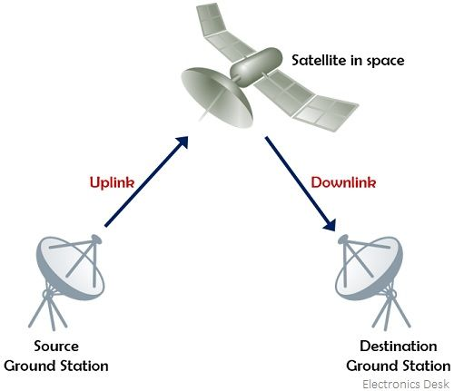
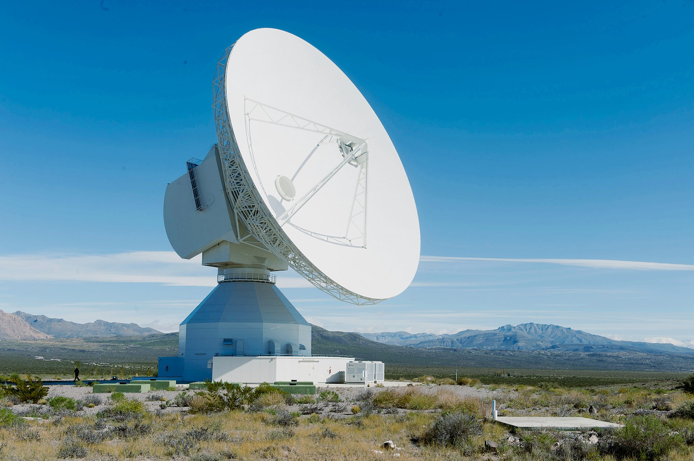

Les satellites font partie intégrante de nos vies. Qu'ils soient d'origine naturelle comme **La Lune** ou les **comètes**. Ou alors d'orgine humaine comme le tout premier **Spoutnik 1** en **1957** ou notre bonne vieille **ISS** (**S**tation **S**patiale **I**nterntionale) dont le premier module a été lancé en **1998**.
Nous allons faire un long voyage pour comprendre en quoi ces satellites sont exposés à des attaques informatiques et surtout comment s'en prémunir. 
Mais avant tout ça, voyons quelques généralitées. 
⚠️Ce cours s'inspire directement de ce que j'ai appris au cours de la certification [Aerospace Cybersecurity: Satellite Hacking (W53)](https://pentestmag.com/course/aerospace-cybersecurity-satellite-hacking-w53/). Elle contient un merveilleux cours que je recommande vivement réalisé par la très inspirante [Angelina Tsuboi](https://www.angelinatsuboi.net) qui m'a donné son accord pour que je réalise ce dernier. Il s'agit que là d'une manière d'expliquer à ma manière et en français :) ⚠️

# ⚪️ Aperçu d'un système de communication par satellite

Donc globalement, on a **3 composants** : 
- Les stations de sol qui comme leur nom l'indique sont placées au sol, sur **Terre** donc. Elles transmettent et recoivent des signaux.
- Les satellites, qui sont dans l'**espace** et comme les stations de sol transmettent et recoivent des signaux. 
- Les liaisons de communications qui permettent la communication entre les **stations de sol** et les **satellites**. On parle de **liaison montante** (**uplink**) quand la communication se fait de le **station de sol** vers le **satellite**. Et de **liaison descendante** (**downlink**) quand la communication se fait du **satellite** vers la **station de sol**. 

Le composant principal qui gère les communications s'appelle un **transpondeur**. C'est lui qui convertit le signal reçu sur une autre fréquence avant de le retransmettre en **downlink**. Ça permet ainsi d'éviter que les fréquences se chevauchent. 
# ⚪️ Les stations de sol
On peut aussi les appeler **stations terriennes**. C'est en général ces grosses paraboles super stylées qu'on voit dans les films (ou dans la vraie vie accessoirement) :

Elles ont plusieures fonctions principales : 
- **Communication** : Pour transmettre et recevoir les signaux des satellites
- **Contrôle** : Pour suivre et contrôler l'orbite du satellite en envoyant des commandes au tavers de **payloads** (**charge utile** en français 🤢) donc juste des bouts de code qui disent quoi faire au satellite. 
- **Traitement des donnée**s : Pour collecter, traiter et analyser ce que nous renvoit les satellites en fonction de son rôle. 

# ⚪️ NORAD ID
Chaque satellite possède un identifiant **NORAD** qui comporte **5 chiffres**. 
Ça permet d'avoir un beau catalogue permettant un suivi des différents éléments en orbite d'une taille supérieure à **10cm**. Ainsi, on peut anticiper d'éventuelles collisions.
À noter que quand un objet dans l'espace explose, tous débris plus grand que **10cm** se verra aussi attribuer un identifiant **NORAD**. 

