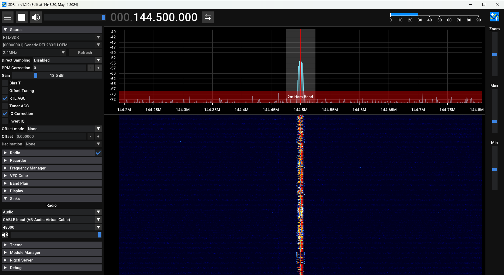
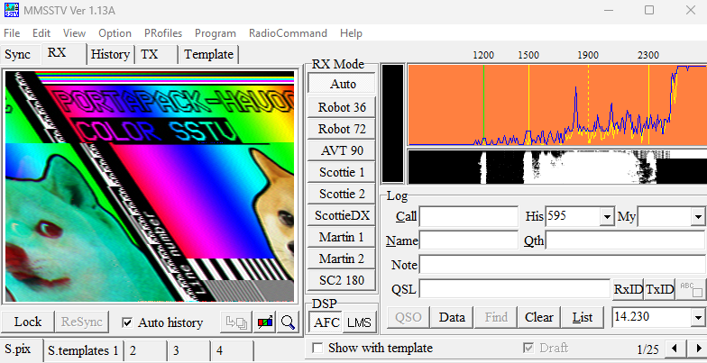

# ⚪️ C'est quoi la SSTV ?
La **SSTV** (**S**low **S**can **T**elevision) est une méthode de transmission d'images avec des ondes radios. Ça existe depuis 1950 et c'est plus du tout utilisé aujourd'hui parce qu'envoyer une image, c'est quand même plus facile avec **Internet**. Néanmoins, pour les amateurs radios, c'est sympa à expérimenter.  
Pour rentrer en détail dans ce mode de fonctionnement, il y a ce [pdf](https://www.radioamateurs-france.fr/wp-content/uploads/2015/07/G-8-8-SSTV.pdf) qui est pas mal. 

# ⚪️ Comment la transmettre ?
Depuis notre **HackRF**, on se rend dans l'onglet **Transmit**, puis **SSTV**. Cette dernière va nous permettre d'envoyer des images  stockées sur notre carte SD. (2 images sont déjà présentes avec le firmware).

Sur le **HackRF**, il y a 6 différents **mode de transmission** à notre disposition. Sans trop rentrer dans les détails, on va dire que la principale différence se joue sur le temps de transmission : 
- **Scottie 1** (110s), le plus utilisé avec une bonne qualité.
- **Scottie 2** (71s), avec une transmission plus rapide au détriment d'une qualité légèrement inférieure. 
- **Scottie DX** (270s), utilisé pour les longues distances, haute qualité mais transmission très lente. 
- **Martin 1** (114s), bon rapport qualité/temps
- **Martin 2** (58s),  avec une transmission rapide mais pareil, une moins bonne qualité. Il a surtout l'avantage de "mieux" se propager.
- **SC2-180** (180s), la meilleure qualité 😎. 

Si non, qu'importe le mode, ce sera toujours une résolution en **320x526 pixels**. Le **HackRF** ne prendra en charge que des images au format `.bmp` avec une taille de 320x256 donc. 
Ensuite, on peut choisir la fréquence sur laquelle on veut émettre. On va choisir la **144.500MHz** qui est utilisée par les **radio amateurs** pour la **SSTV**. 
Et on peut appuyer sur le bouton **Start** pour commencer à émettre.

# ⚪️ Et pour recevoir ?
Afin de recevoir ses signaux, on va utiliser le logiciel [MMSTV](https://hamsoft.ca/pages/mmsstv.php). C'est lui qui va récupérer en entrée un signal pour pouvoir le décoder en une image. 
Par contre, il ne peut pas écouter le signal comme le ferait un logiciel **SDR** donc on va devoir écouter le signal avec par exemple **SDR++**, et renvoyer ce signal vers **MMSTV**. Pour ce faire, on va utiliser un câble audio virtuel en installant [VB-Audio](https://vb-audio.com/Cable/). Suffit juste d'installer les drivers et de redémarrer le PC pour s'en servir. 
Lançons **SDR++** pour déjà voir si on a bien un signal 

Ok, on voit bien notre pic sur la fréquence qu'on avait choisit. Ça, c'est niquel, on en profite aussi pour changer l'**output** de l'audio à gauche en sélectionnant notre **câble audio virtuel**. 
À présent, lançons **MMSTV**, et changeons d'**input**. Pour cela, on va dans **Option -> setup MMSTV -> Misc** et on remplace le **In** avec notre **cable audio virtuel**

Ok, à présent tout est prêt. Y a pleins d'autres paramètres à potentiellement explorer sur ce tool mais ça va au delà de mes conaissances et ça ne sera pas nécessaire pour ce qu'on veut faire de toute façon.
Rien n'est à démarrer côté **MMSTV**, si les entrées et sorties sont configurées sur les deux logiciels et que le **HackRF** est bien en train d'émettre, l'image apparaîtra petit à petit.
Voilà mon résultat : 

Comme vous pouvez le constater, mon image est penchée, j'ignore encore pourquoi mais dans l'idée, voilà comment fonctionne la **SSTV** :) 