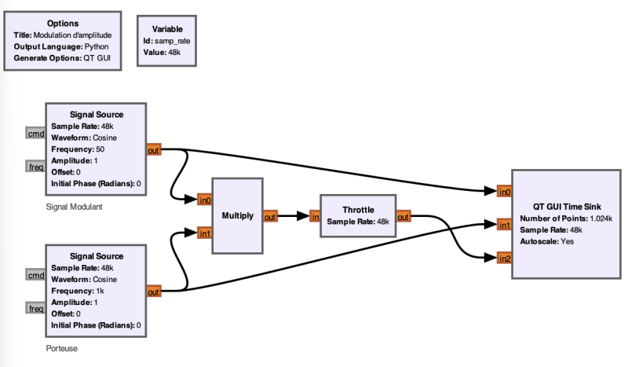
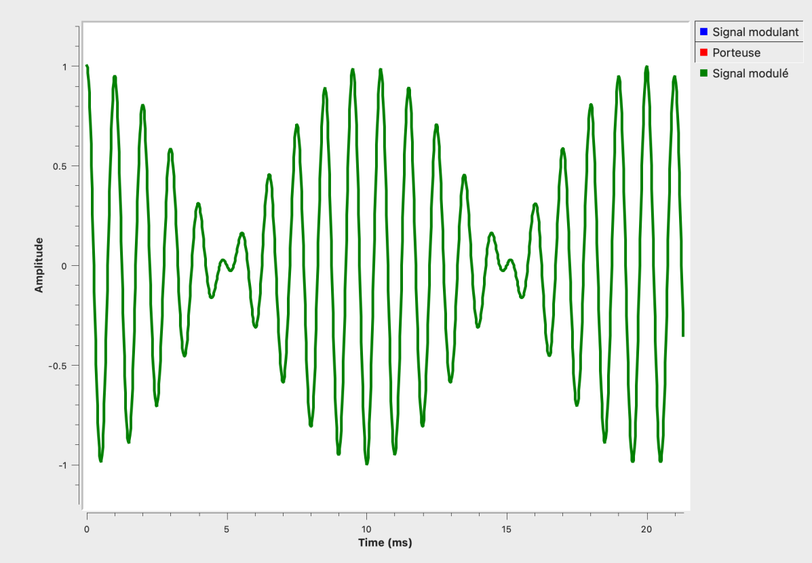
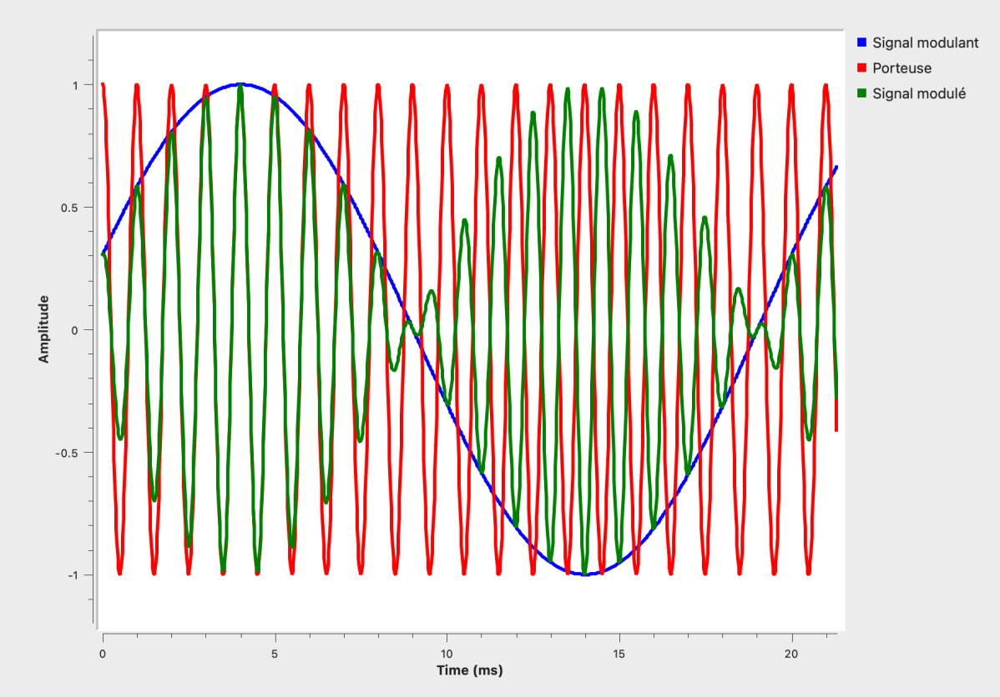

Ce cours fait suite à [Pourquoi moduler un signal ?](/Mini-cours/Modulation/Pourquoi%20moduler.html)
# ⚪️ Principe de la modulation d'amplitude
Déjà, pour être sur de bien comprendre, rappelons que l'**amplitude** d'un signal est en gros sa **hauteur maximal** par rapport à sa position au repos. 
En **AM**, on va venir faire varier l'**amplitude** de l'**onde porteuse** en fonction de l'**amplitude** du **signal modulant**. 
Pour mieux comprendre, on va utiliser **GNURadio**. On fera un cours plus tard sur ce fabuleux logiciel. 

On place 2 blocs `Signal Source`, un pour notre **Signal Modulant** qui a une fréquence de `20Hz` puis un second bloc qui sera notre onde porteuse avec une fréquence de `1000Hz` donc bien plus élevé que le signal modulant.
Le bloc `Throttle`, on s'en fiche pour ce cours mais sachez qu'il est là pour éviter de faire crash le PC en réduisant la cadence à laquelle le CPU voudrait éxecuter le programme. Un seul placé quelque part suffit, c'est pour ça que y en a un juste un. bref, revenons à ce qui nous intéresse.
Le bloc `QT GUI TIME SINK` va nous permettre de visualiser nos deux signaux dans le temps. 
Voilà ce qui nous affiche lorsque l'on lance notre programme : 

On voit nos 2 jolies sinusoides. 
# ⚪️ Modulation
A present, superposant nos deux signaux en les **multipliant**. On va pas rentrer dans les maths qui se cachent derrière (peut-être un jour). 

Donc ici, on a juste rajouté le bloc `Multiply` et on revoit le signal modulé dans notre `Time Sink`. J'ai aussi laissé les 2 autres signaux au `Time Sink` pour qu'on puisse mieux comprendre. 
Lançons le programme et laissons aparraître uniquement le **signal modulé** pour voir à quoi il ressemble. 

On peut voir cette forme de signal caractéristique de l'**AM**. 
Et maintenant, affichons nos 3 signaux (modulant, porteuse et modulé)

On comprends déjà mieux, lorsque que l'**amplitude** de notre **signal modulant** diminue, il diminue en conséquence l'**amplitude** de la **porteuse**. 
Ça sera tout pour ce cours, c'est vraiment juste les basiques des basiques à savoir sur la modulation d'amplitude. Je remettrais à jour ce cours lorsque je serais en mesure d'expliquer les notions plus complexes de l'**AM**. 