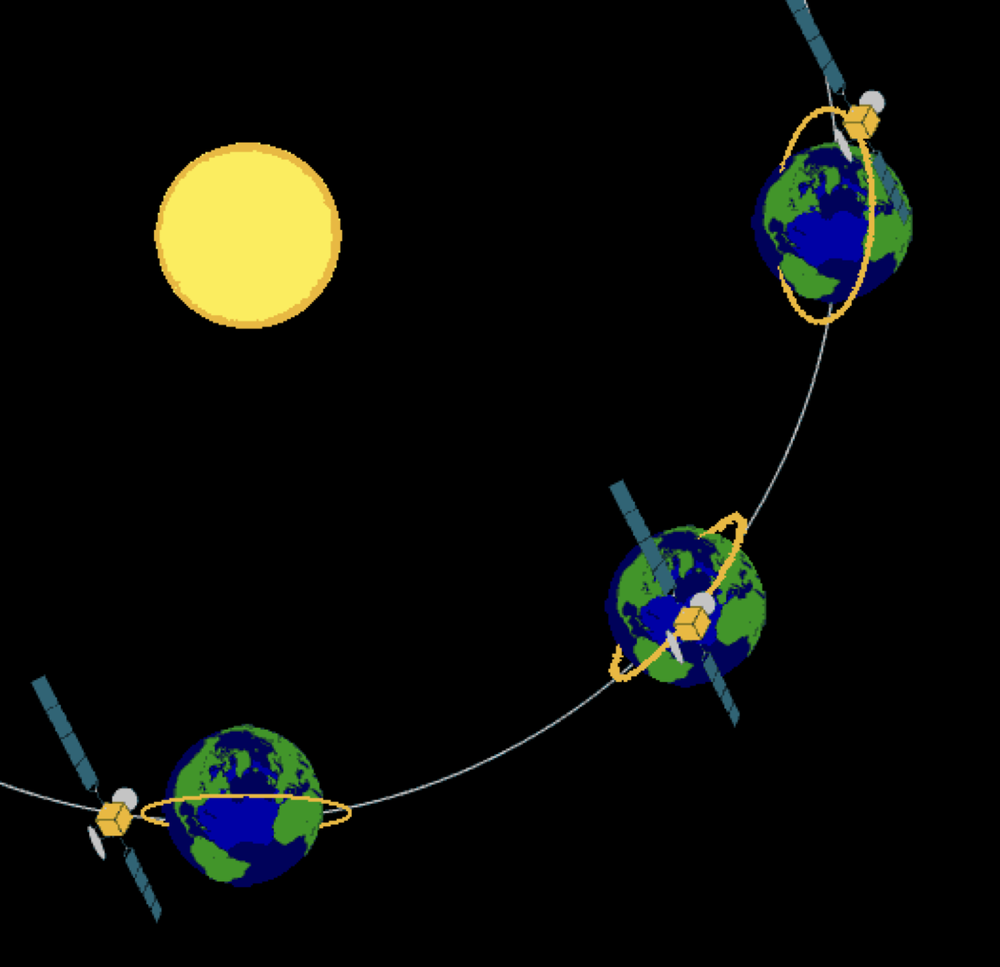
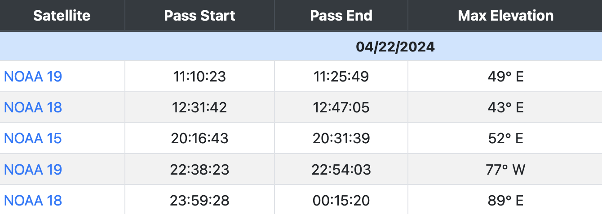
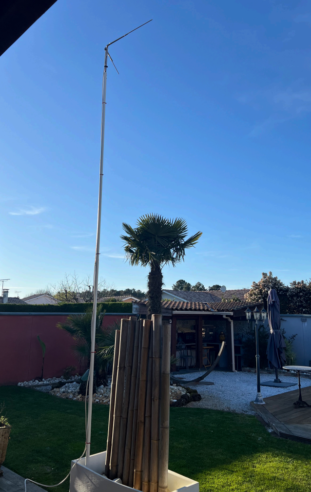
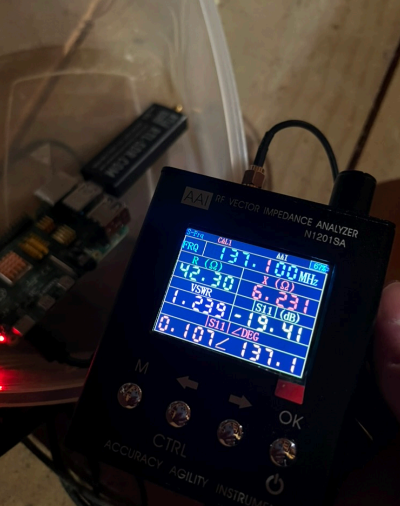
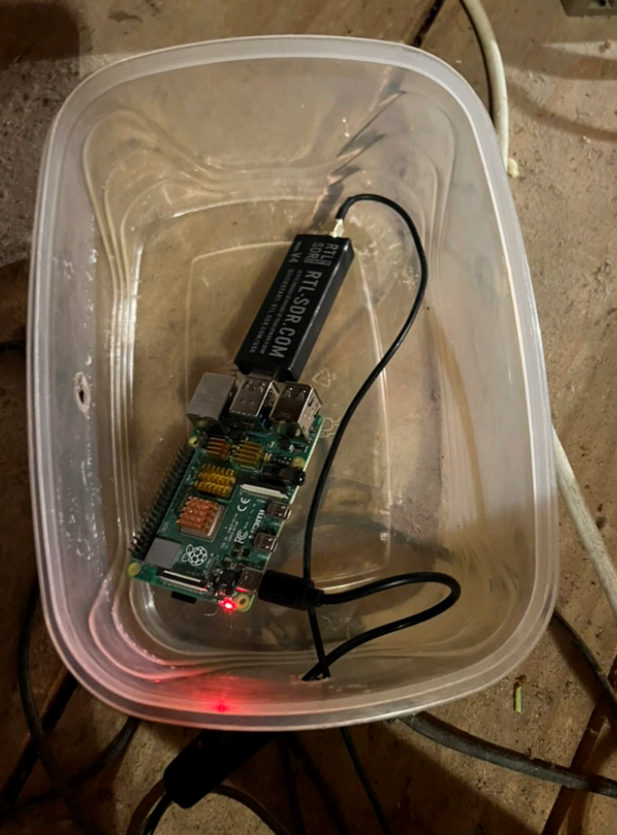
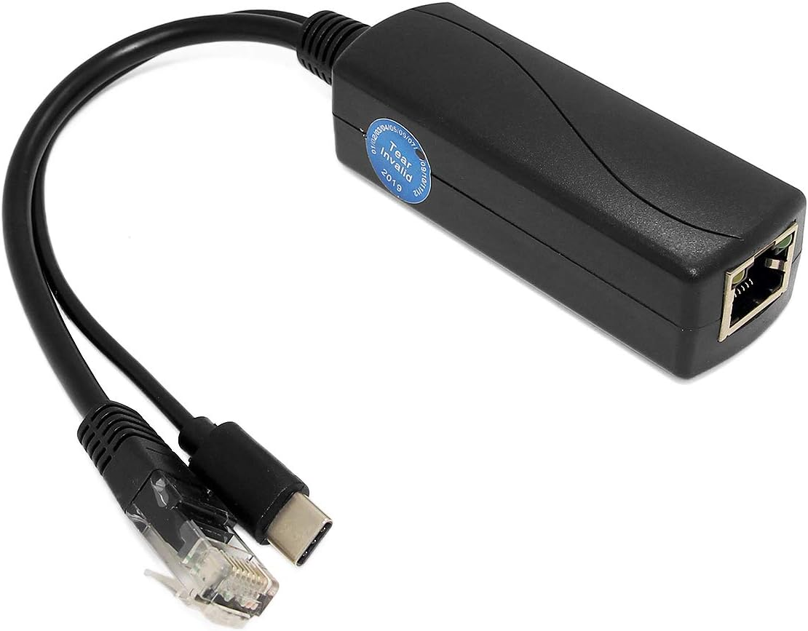
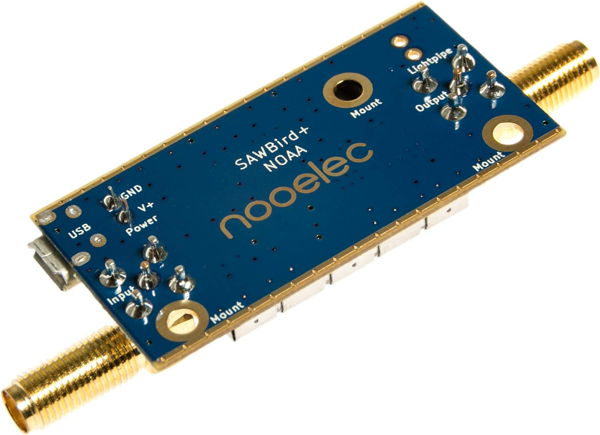

# ⚪️ Compréhension du projet 
## Qui sont-ils
Les satellites **NOAA** (**N**ational **O**ceanic and **A**tmospheric **A**dministration) sont des satellites météorologiques américains à orbite polaire qui sont à une altitude de 850km. 
Pour comparer, l'**ISS** est à 400km. 
A ce jour, il y en a 3 qui continuent d'émettre : 
- **NOAA 15** à `137.6200MHz`
- **NOAA 18** à `137.9125MHz`
- **NOAA 19** à `137.1000MHz` 

Leur fréquence étant publique, n'importe qui avec le matériel adéquat peut recevoir leurs 
images. Ils ne sont plus en période d'exploitation mais tant que la **NASA** considère qu'ils ne sont pas un danger, ils continuent de les laisser tourner. 
## Orbite héliosynchrone
Ces satellites ont une orbite circulaire qui les font passer d'un pôle à l'autre de La Terre. 
Ils se présentent toute l'année sous le même angle par rapport au Soleil comme le montre l'image ci-dessous : 

Ainsi, comme La Terre tourne sur elle même, le satellite peut balayer toute sa surface. Grâce à des logiciels ou sites web, on peut calculer ses orbites et prévoir le passage de chacun par rapport à des coordonnées géographiques. 
Par exemple, voici une liste de prédictions des 3 satellites au dessus de la ville où est installée mon antenne le 22 avril 2024 : 

## Transmission APT
Les **NOAA** ne prennent pas directement des photos de la Terre. Ils en font plutôt un **scan** comme le ferait un scanner papier à une vitesse de 2 lignes par seconde, donc c'est lent. 
Pour cela ils vont utiliser le mode [APT](https://en.wikipedia.org/wiki/Automatic_picture_transmission) (**A**utomatic **P**icture **T**ransmission). Il date de 1960 et seules 3 satellites l'utilisent encore. 
La qualité est de 4km pour 1 pixel donc il ne faut pas zoomer si non, c'est très moche. 
Voici un exemple d'image transmise que j'ai reçu avec ce système :

La transmission est composée de **deux canaux d'images**, des **informations télémétriques** et des **données de synchronisation**. 
- Le premier canal d'image est pris avec un capteur dans les longueurs d'onde visibles. (Un autre capteur peut être utilisé en fonction de la quantité de nuages). 
- Le second canal utilise un capteur **infrarouge**. 
- La bande à **gauche** de chaque image sont les données de **synchronisation**. En effet, en **radio**, les ondes peuvent faire des rebonds dans l'atmosphère ou sur d'autres obstacles. A terme, elles peuvent ne pas arriver dans le bon ordre jusqu'à l'antenne, donc ces **bits** sont là pour les remettre dans le bon ordre et être sûr qu'on reçoive le scan correctement. 
- Les **2** bandes à **droite** de chaque image sont les données **télémétriques**. Il s'agit d'informations envoyés concerant le satellite ainsi que des données pour la météo (C'est à ça qui sert après tout). 
Toutes ces données vont être envoyées ligne par ligne à l'horizontal. 
Avant d'être diffusées, les images recoivent des corrections géométriques permettant ainsi d'être exempt de la **distorsion** causée par la **courbure** de la Terre (**Car la Terre n'est pas plate**).
Ainsi, avec ces deux images capturées, on peut obtenir d'autres types d'image. Par exemple, voici une image thermique générée par les deux images précédentes : 

C'est grâce à ce genre d'image que les personnes dans la météorologie (pas moi) seront à même de prédire le temps qu'il va faire ⛈️.
# ⚪️ Mise en place du projet
## Partie matérielle
### Fabrication de l'anntenne
Pour ce projet, j'ai décidé de partir sur une antenne **V-dipôle**. 
Comme on l'a vu sur la partie des antennes, pour que notre antenne soit **résonnante** à la fréquence de **137MHz**, on peut faire le calcul suivant : 
$$λ=300/137≈2.18m$$

On va faire une antenne **demi-onde** donc elle devra faire une longueur de `2.18/2` soit `1.09m`. 
De plus, comme on fait un **dipôle**, on va devoir diviser à nouveau par **2** pour avoir la longueur de chaque pôle. Donc `1.09/2≈0.54`. On sait à présent que chaque pôle devra faire **54cm** pour être efficace au **137MHz**. 
Afin d'avoir une impédance de **50Ω**, l'angle formé par les 2 pôles doit être de **120°**. Voici un schéma qui reprend la même logique. 

Le raccordement entre les pôles et le câble se fait avec un domino. On relie la tige centrale du câble à l'un, et la tresse autour du câble à l'autre. 
Premier test avec une antenne rateau trouvé en déchetterie que j'ai remodelé : 

Lors de la réalisation de ce premier modèle, je n'avais pas encore connaissance de ce qu'était le **rapport d'onde stationnaire (SWR)** et je n'ai donc pas pu tester si c'était une bonne antenne à part en observant les résultats des images. Malheureusement, le résultat n'était pas très convaincant.
Je décide alors d'investir dans un **testeur d'antenne** qui me permettra de calibrer mes antennes. 
Et c'est grâce à lui que je me rends compte que le **SWR** vaut **11** avec une **impédance** de **20Ω** ce qui ne va PAS DU TOUT. 
Le soucis ? Un pôle en touchait un autre ce qui faitait comme un court-circuit au final. On voit pas très bien sur la photo mais les pôles de l'antenne sont soutenues par un plus petit morceau d'aluminium (accroché avec les serflexs). Or cette pièce est en un seul morceau et est en contact avec les deux pôles... 
Je décide alors de changer la conception de l'antenne en prenant cette fois-ci 2 tiges en **cuivre** (meilleure conductivité). 

On sort le testeur d'antenne et voici le résultat : 

Le deux valeurs à prendre en compte sont 
- L'impédance -> **R (Ω)** qui est dans de **58Ω** donc pas les **50Ω** idéales mais relativement proche donc c'est cool.
- Le rapport d'onde stationnaire -> **VSWR** qui doit être au plus proche de **1**. Et là, **2.8**, c'est pas terrible. 
  
Je repars à la charge avec une troisième conception. Je récupère à nouveau à la déchetterie, une vieille antenne TV pour caravane. J'avais pas pensé de prendre de photos quand je l'ai récup donc voici une image de ce à quoi ça ressemblait : 

Elle est pratique car on peut y visser les pôles et régler leur orientation ce qui nous facilite le travail pour le réglage de l’impédance. On fait donc un trou dans nos tubes de cuivre pour remplacer les deux morceaux qu’il y avait de base. On peut se servir de l’attache en métal à l’arrière pour la fixer à notre mas et voici à quoi ça ressemble à la fin :

En ce qui concerne la soudure, j’ai oublié de prendre en photo l’intérieur mais chaque tube de cuivre est soudé à un câble respectif qui lui même est déjà relié d’usine à la prise coaxiale dans le boitier. J’ai un peu redécoupé la partie blanche pour pas que ça fasse trop gros. Dans le boitier blanc, il y a déjà une prise coaxiale pour l’arrivée d’un câble. Donc on a plus qu’à venir visser notre cable coaxial dessus et on est tout bon. 
On ressort le testeur d’antenne et voici le résultat final : 

- Le VSWR est très proche de 1 ce qui est vraiment pas mal pour le coup. 
- L'impédance de 42Ω n'est pas parfaite mais reste tout à fait correct. 
### Placement et Orientation
Les **NOAA** avec leur orbite polaire arrive soit par le **nord** soit par le **sud**. Par conséquant, on doit orienter l'antenne dans l'une de ses directions n'importe laquelle. Si on la place vers le **nord** alors que le satellite arrivait par le **sud**, on aura juste à retourner l'image.  :) 
Voilà le rendu final de l'antenne sur le toit orienté plein **sud** dans mon cas : 

### Raspberry
Pour ce projet, j'utilise un **Raspberry 4 model B** qui tourne sur **Raspbian lite OS** en **64-bits**. Il n'aura pas d'**interface graphique** afin d'éviter toutes fréquences parasites provoquées par la consommation du **CPU** et de la **RAM** à cause des composants graphiques. 
Ce dernier sera placé dans les combles dans un tupperware avec comme récepteur SDR la clé **RTL-SDR V4**. Il est relié par **11m** de câble coaxial :

## Partie logicielle
### Github
Au départ, j'avais réalisé mes propres scripts pour démarrer les enregistrements automatiquement en récupérant les positions de satellites pour calculer leur passage. 
En revanche, afin de me consacrer plus à la partie radio et avoir un code propre et très modulable, j'ai décidé d'utiliser ce [dépôt Git](https://github.com/jekhokie/raspberry-noaa-v2) qui va grandement nous être utile. 
Pour l'installation, on le `clone` sur le **Raspberry**, on édite un fichier `settings.yml` pour y mettre nos coordonnées **géographiques** ainsi que d'autres paramètres que l'on verra plus loin. 
On a plus qu'à lancer l'installation et nous voilà avec un site web affichant tous les passages prévus des satellites, un enrengistrement qui se lance automatiquement et une page **Capture** avec l'ensemble des images récupérées. Super pratique ! 
### Accès à distance 
A l'aide du dépôt **Github** précédemment cité, un serveur web **nginx** est créé en `localhost` sur le **Raspberry**. 
Ce dernier est configuré avec une adresse **IP fixe** et est donc accessible que depuis le réseau local. 
Afin d'y avoir accès depuis n'importe où, j'ai mis en place un serveur VPN avec **Wireguard** sur ma box Internet. Ainsi, tant que je dispose du fichier wireguard `.conf`, je peux accéder au réseau local et donc au **Raspberry** depuis n'importe où, y compris le téléphone !  
### Prédiction
On a un **cronjob** qui va se lancer chaque jour à **00h00**. Il va s'occuper d'aller chercher les [TLE](<../Cybersécurité spatiale/Satellite Basics/ordbit.md>) (**T**wo **L**ines **E**lements) des satellites en ligne. Il s'agit d'une représentation standardisée des **paramètres oribtaux** des objets en **orbitre terrestre**. C'est grâce à ces paramètres que l'on va pouvoir prédire à quelle heure un satellite va passer au dessus d'un point donné. 
Une fois récupérée, on a une base de donnée à jour contenant la position des satellites qui nous intéressent. 
Ainsi, on peut faire appel à l'outil `predict` qui comme son nom l'indique, va prédire le passage des satellites en sa basant sur les **TLE**, et sur une **position géographique**. Ce dernier va nous donner une intervalle durant laquelle le satellite va passer en nous indiquant l'élévation maximale du passage. 
Un exemple de la commande lancée manuellement : 
```bash
> nugget@noaa:~ $ predict -p "NOAA 15" -t /home/nugget/.config/satdump/satdump_tles.txt
1714330922 Sun 28Apr24 19:02:02    0  173  192   17  358   3297  35014 * 0.000000
1714331020 Sun 28Apr24 19:03:40    7  175  196   23  359   2648  35014 * 0.000000
1714331117 Sun 28Apr24 19:05:17   15  178  200   29    0   2017  35014 * 0.000000
1714331212 Sun 28Apr24 19:06:52   29  185  204   35    2   1446  35014 * 0.000000
1714331299 Sun 28Apr24 19:08:19   49  202  208   40    4   1030  35014 * 0.000000
1714331365 Sun 28Apr24 19:09:25   64  248  211   43    5    886  35014 * 0.000000
1714331410 Sun 28Apr24 19:10:10   59  293  213   46    6    919  35014 * 0.000000
1714331461 Sun 28Apr24 19:11:01   45  318  215   49    7   1079  35014 * 0.000000
1714331532 Sun 28Apr24 19:12:12   29  331  218   53    9   1423  35014 * 0.000000
1714331618 Sun 28Apr24 19:13:38   17  337  222   58   12   1937  35014 * 0.000000
1714331713 Sun 28Apr24 19:15:13    8  341  226   63   16   2543  35014 * 0.000000
1714331810 Sun 28Apr24 19:16:50    1  343  230   69   21   3185  35014 * 0.000000
1714331830 Sun 28Apr24 19:17:10    0  344  230   70   23   3314  35014 * 0.000000
```
Ici, on demande les prédictions du satellite **NOAA 15** en précisant un fichier **TLE** à jour. L'élvation est indiqué par la **5ème** colonne.
On voit que le prochain passage aura lieu entre **19:02** (première ligne) et **19:17** (dernière ligne) et que l'élévation maximale aura lieu à **19:09** (6ème ligne) et sera de **64°**. 
À noter que j'ai configuré l'outil pour qu'il fasse les enregistrements uniquement pour les passages avec une élévation supérieure à **40°**, autrement, la réception n'est pas top. 
Mais au final, qu'est ce qu'on enrengistre, des images ? Et bien non. En réalité, l'enregistrement consiste en la récupération d'un fichier audio ! 
La commande principale est celle-ci : 
```bash
timeout "${RECORD_TIME}" rtl_fm -f "${FREQUENCY}M" -s 60k -g 40 -p 55 - | sox -t raw -r 60k -es -b 16 -c 1 - "${wav_file}" rate 11025
```
Décortiquons là en prenant comme exemple la prédiction de **NOAA 15** vu précédemment : 
- `timeout "${RECORD_TIME}"` -> On laisse tourner la commande pendant `${RECORD_TIME}` secondes. Dans notre cas, ça serait la soustraction entre le timestamp de la dernière ligne et la première soit `1714331830-1714330922=908`  qui vaut environ **15 minutes**. 
- `rtl_fm` est la commande permettant de démarrer l'enregistrement avec notre clé **SDR**. On lui passe comme argument : 
	- `-f` -> La fréquence en **MHz** qui est de **137.62** pour **NOAA 15**.
	- `-s` -> La fréquence d'échantillonage en **kHz**. Dans notre cas, on capture **60 000** échantillons du signal chaque seconde. **60k** est une bonne valeur pour conserver une bonne qualité sans avoir un fichier trop lourd.  
	- `-g` -> Le gain est une mesure de l'amplification du signal par rapport au bruit de fond. Plus cette valeur est élevée, plus on pourra percevoir des signaux faibles mais en contrepartie il y aura plus de bruit. Il faut alors trouver un juste milieu en faitant plusieurs essais afin de conserver le signal sans avoir trop de bruit. À ce jour, je n'ai pas encore trouvé la valeur idéale mais **40** me convient. 
	- `-p` -> Il s'agit de la **préaccentuation**. Il s'agit d'une technique pour compenser les pertes et améliorer le bruit en fonction du récepteur **SDR**. **55** semble faire unanimité pour ma clé **RTL-SDR V4**
	- `-` -> C'est juste pour dire de ne pas rediriger le résultat de la commande dans un fichier ou sur le terminal mais va être redrigié vers la commande `sox` avec le `|`. 
- `sox` est une commande nous permettant de faire des opérations sur des fichiers audio. Ici, on va s'en servir pour obtenir un fichier `.wav` : 
	- `-t` -> On indique qu'en entrée, on a un fichier brut `.raw`. (C'est ce que nous sort `rtl_fm`).
	- `-r` -> On précise à quel fréquence d'échantillonage est le fichier brut. Donc, il faut que ça soit aussi **60k**.
	- `-es` -> On spécifie l'encodage des échantillons. `es` désigne un encodage avec **virgule flotante avec signe**. C'est juste pour avoir une représentation plus précise qu'avec un encodage avec **entier**. 
	- `-b` -> C'est la résolution des échantillons en **bits**. Donc là, nos échantillons sont représenté par des nombres en **16 bits**. C'est une norme courante dans le traitement numérique cette valeur. Ça permet des échantillons pas trop lourd mais avec une précision suffissante quand même. 
	- `-c` -> Le nombre de canal, faut le spécifier et comme on est pas en stéréo, on met **1** ce qui signifie **mono** donc. 
	- `rate` -> On réduit la fréquence d'échantillonage à **11025Hz** car le tool qu'on utilisera par la suite pour la conversion demande cette valeur. 
### ~~Magie~~ Conversion 
Ok, à présent, on a un super fichier audio. Il nous reste plus qu'à le transformer en une image à l'aide du logiciel `WXtoIMG`. Ce dernier prend uniquement en entrée notre fichier `.wav` et s'occupe de faire la magie tout seul. On peut lui spécifier un mode de transformation pour l'image. Ce dernier va combiner les 2 images reçues du satellite pour en créer une selon notre besoin. Par exemple, on peut en générer une thermique comme celle qu'on a vu au début mais on peut aussi lui demander de coloriser l'image du mieux qu'il peut et même afficher les frontières le long des mers et océans. Voici un des résultats que j'ai reçue le **18 avril** par **NOAA 18** :  


# ⚪️ Suite et Améliorations
## HRPT
En réalité, ces satellites peuvent envoyer de plus belles images que ça. On l'a dit, mais le protocole **APT** date de **1960** alors que ces satellites ont été envoyés dans les années **2000**. En fait, c'est juste pour une question de rétro-compatibilité avec de vieux équipements. Mais si non, les météorologues vont utiliser un protocole plus récent, le [HRPT](https://en.wikipedia.org/wiki/High-resolution_picture_transmission) ( **H**igh-**R**esolution **P**icture **T**ransmissions). Les **NOAA** envoient avec ce mode sur des fréquences plus hautes, **1700MHz**. Leur récéption demande plus de conaissance et surtout une antenne tout autre. Il s'agit de la suite logique de ce projet afin d'avoir des images toujours plus belles car là où l'**APT** nous donnait du **4km/pixel**, l'**HRPT** nous donne du **1km/pixel**. C'est comme passé d'un écran **FULL HD** à de la **4K** :)  
## Setup Raspberry
Actuellement, le **Raspberry** est à plus de **10m** de l'antenne et est alimenté avec son transformateur d'origine et connecté en **Wi-Fi**. 
Ok, mais on peut faire mieux même si c'est pour un gain minime sur le projet (le but c'est d'apprendre de toute façon). 
Donc actuellement, je réfléchis à une solution pour venir mettre le **Raspberry** dans une boîte étanche directement en dessous de la tuile où se situe l'antenne. Cela me permettrait de passer de **11m** à **5m**. Ça permettra de minimiser les pertes dans la câble. 
De plus, toute interferance est bonne à enlever, même minime. On l'a vu avec les composants graphiques. 
On peut faire une pierre 2 coups afin d'enlever les mini interferences du transformateur ET avoir une connexion **Ethernet** qui sera bien meilleure que par **Wi-Fi**. Pour cela, on va utiliser un **PoE Splitter** qui va nous permettre à la fois d'alimenter le **Raspberry** ET de lui fournir une connexion à travers un seul câble Ethernet qui part du splitter jusqu'à un port **PoE** de ma box Internet. 

## Filtre et amplificateur
Bien que la clé **SDR** a pour rôle d'enregistrer dans la fréquence qu'on lui demande, elle n'est pas parfaite et il y aura toujours des signaux parasites autour. Pour régler ce problème, on peut utiliser un **LNA** (**L**ow **N**oise **A**mplicator). Il va nous permettre de filtrer les signaux dans une gamme de fréquence bien spécifique. 
J'ai donc invesit dans un **LNA 137MHz**. Ce dernier va laisser passer que les fréquences dans les **137MHz** et en plus amplifier le signal avec un ajout minimal de bruit. 
Voici à quoi ressemble ce dernier sans son chassis : 

Il est important de le placer au plus prêt de l'antenne, afin d'amplifier le signal dès que possible. Ainsi, on est sur que le signal ne se perde pas durant le trajet. 
## SatDump
`SatDump` est un nouveau venu dans le milieu de la réception d'images satellites. Il s'agit d'une solution tout-en-un permettant à la fois l'enrengistrement ET la conversion de l'audio en image. 
Il existe en ligne de commande et avec une interface graphique. Il est récent, "joli" et plus performant d'après ce qu'on entend. En effet, `WXtoIMG` est un vieux logiciel qui n'est même plus maintenu malheuresement. 
Ainsi, pour la suite de ce projet, j'ai déjà commencé à mettre en place ce dernier. N'étant pas encore fonctionnel, je le présente ici comme axe d'amélioration. 
# ⚪️ Ressources et inspirations 
Cette section indique les ressources que j'ai principalement utilisé pour la compréhension en général de ce projet :
- Mon père :
	- Astuces bricolages pour l'antenne (merci à lui ❤️)
- Site Web :
	- **Wikipédia**
	- https://github.com/jekhokie/raspberry-noaa-v2
	- **F4IAI**
	- https://www.instructables.com/Raspberry-Pi-NOAA-Weather-Satellite-Receiver/
	- https://on5vl.org/noaa-satellite-meteo/
	- https://www.qsl.net/kd2bd/predict.html
	- https://wxtoimgrestored.xyz/
	- https://www.satdump.org/
	- ...Bien d'autres que j'ai du oublier...
-  Youtube : 
	- **thonain**
	- **Ham Radio Crash Course**
	- **European GNU Radio Days**
	- **RADIOAMATEUR - PAR F4HTZ**
	- **sn0ren**
	- **saveitforparts**
	- Et d'autres cours **radio** diverses
