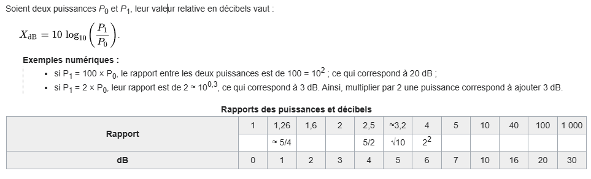
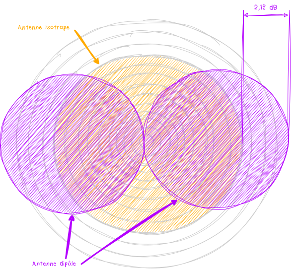

Quand il s'agit de comparer les puissances entre des antennes, on entend souvent parler de **décibel**, de **gain** et de pleins d'autres acronymes. Avec ce cours, on va passer en revue ces différentes notions sans trop les approndir noin plus :) 

# ⚪️ Qu'est ce que les décibels ? 
Les **décibels** (**dB**) sont une unité **logarithmique** utilisée pour exprimer le rapport entre deux valeurs.
**Logarithmique**, ça veut en gros dire que la valeur est exprimée en fonction de l'ordre de grandeur. Du coup, au lieu d'utiliser des multiplications, on va utiliser des additions ce qui simplifie grandement la vie. Par exemple, si une puissance double, genre de **10W** à **20W**, ça correspond à une augmentation de **3dB**. Si derrière ça redouble, de **20W** à **40W**, on ajoute à nouveau **3dB** soit un total de **6dB**. Donc, au lieu de multiplier par **2** à chaque fois, on additione juste par **3dB**. Et pourquoi **3dB**, parce que c'est comme ça qu'est définit la formule pour calculer les **dB**. 
P'tit extrait de la page [Wikipedia](https://fr.wikipedia.org/wiki/D%C3%A9cibel#:~:text=Exemple%20%E2%80%94%20Rapport%20en%20d%C3%A9cibels%20de%20deux%20tensions%20%C3%A9lectriques%20%3A&text=La%20premi%C3%A8re%20produira%20une%20puissance,en%20d%C3%A9cibels%20est%2020%20dB%20.) qui l'explique : 

En radiofréquence, on utilise les **décibels** pour exprimer le gain des antennes, la puissance des signaux, et les pertes dans les lignes de transmission. 
Ce qu'il faut retenir, c'est que les **décibels**, ça permet surtout de représenter de gros écarts de puissance de manière plus compacte et compréhensible.

# ⚪️ Et le gain dans tout ça ? 
Le gain, pour une antenne, ça permet de mesurer sa capacité à concentrer l'énergie dans une direction particulière par rapport à l'antenne **isotrope**. Iso quoi ? 
Il s'agit d'une antenne théorique qui **n'existe pas** réellement, qui rayonne de manière **uniforme** dans **toutes** les directions autour d'elle. 
Pour mieux comprendre, on va voir des **diagrammes de rayonnement** et ça sera d'un coup plus clair. C'est juste un moyen de montrer comment une antenne rayonne autour d'elle. 
Donc, sur l'image du dessous, en rose, on a notre antenne **isotrope** théorique qui a son diagramme de rayonnement constitué d'un seul cercle. Son gain est de **0** et nous sert de référence.
Car en effet, on a une deuxième antenne, un **dipole** qui lui favorise son rayonnement dans **2** directions. Ainsi, on voit que ce dernier rayonne plus loin que l'antenne **isotrope**. Ce surplus est ce qu'on apelle le **gain**.

Le gain d'une antenne **dipole** est donc de **2,15dB**. D'ailleurs, lui aussi sert aussi de référence. Ainsi, on parlera de **dBi** qu'on on prend comme référence l'antenne **i**sotrope. Et on parlera de **dBd** qu'on on aura pour référence l'antenne dipole. 
On peut au passage retenir ces 2 fomules : `dBi = dBd + 2.14` et `dBd = dBi - 2.14`

Le gain est donc très important car il permet d'améliorer la qualité d'un signal, il permet aussi d'augmenter la distance à laquelle un signal peut être transmit. À noter qu'un gain peut aussi être **négatif**, on parlera d'atténuation du siganl. 
De plus, on peut utiliser des **amplificateurs** afin de l'augmenter ou alors, avoir une antenne qui favorise une direction pour maximiser le gain comme par exemple les antennes **Yagi**, les fameuses antennes râteaux qu'on a sur nos toits.
