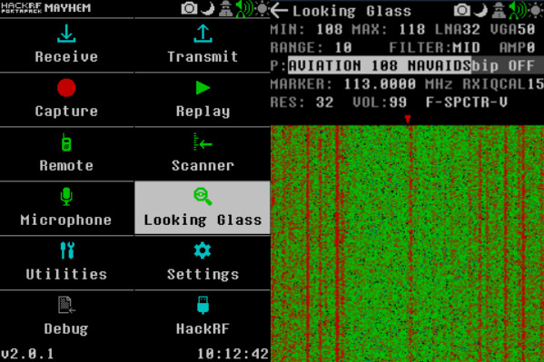
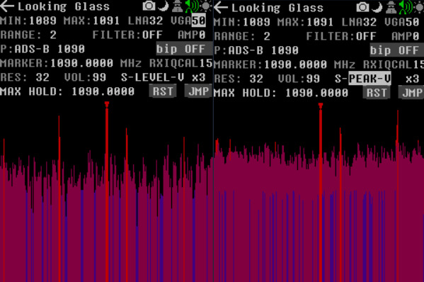
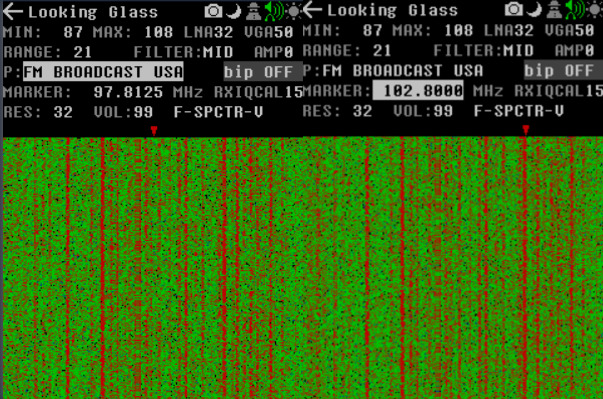
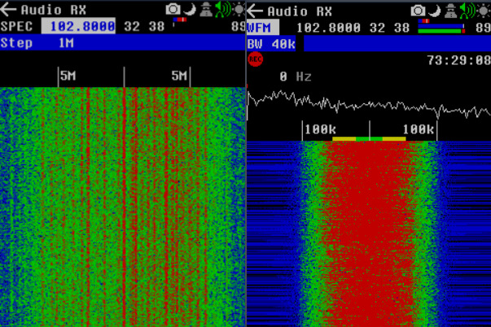
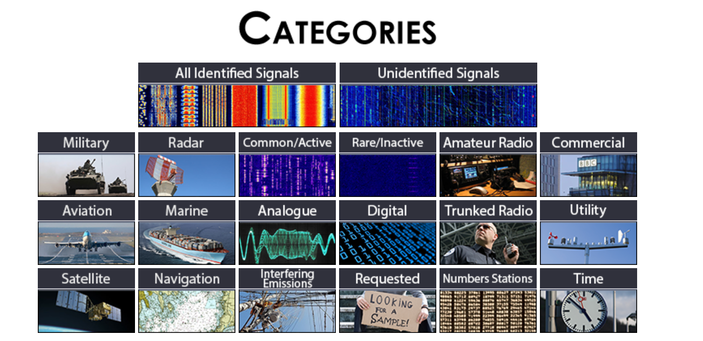
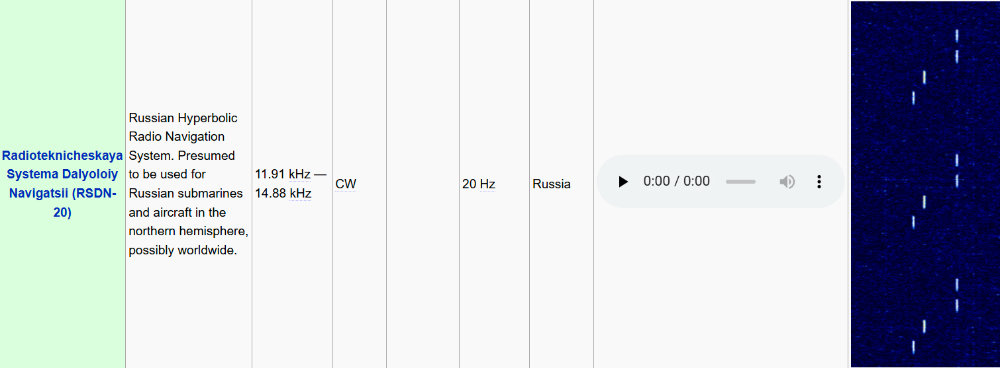

L'un des gros avantages d'avoir un écran sur le **HackRF**, c'est de pouvoir afficher en direct le **spectre** sur une très large gamme de fréquences. Aujourd'hui, je vais vous présenter l'une des applications les plus utiles, **Looking Glass**.   

# ⚪️ Basics
Lançons cette application depuis l'écran d'accueil pour voir apparaître le joli **spectre** sur la droite. 

Plusieurs options s'offrent à nous dont nottament le **P** pour **P**resets. Ça nous permet de sélectionner des ranges de fréquences pré-enregistrées sur la carte SD.
Par exemple, sur la capture, on est sur le preset **AVIATION 108** qui a pour range **108MHz** et **118MHz** représentés par le **MIN** et **MAX** affichés en haut. 
La valeur **RANGE** indique la taille du spectre qu'on reçoit, donc là **10MHz** (118-108). 

# ⚪️ Options 
Voyons les 2 options en bas collées, le **F-** pour **F**ast (Scan plus rapide mais moins précis). On peut le passer en **S-** pour **S**low, le scan sera plus lent mais plus précis.
Et juste à côté de ce paramètre, le **SPCTR-V** qui permet de changer de type de vue. Donc là, c'est le spectre défilant par défaut. Mais on peut aussi choisir **LEVEL-V** pour voir le niveau de puissances des fréquences et la vue **PEAK-V** pour avoir une vue avec les pics de fréquences. 

Comme sur la plupart des applications du **HackRF**, on peut modifier les options de **Gain** en jouant avec le **LNA**, **VGA** et **AMP**.
L'option **FILTER** permet de changer l'affichage du spectre, donc on peut sélectionner celui qui permet d'avoir le meilleur contraste pour faire apparaître les signaux.
Après, on a d'autres options mais pas si importantes que ça (à mon niveau).

# ⚪️ Audio
Mettons-nous sur une range qu'on connaît qu'on peut écouter comme **FM BROADCAST USA** qui a plus ou moins la même range de stations radio qu'en **France**.

Une fois sélectionnée, on peut aller sur l'option **MARKER**, ça permet de bouger le p'tit curseur rouge en haut du spectre. Ainsi, on peut à peu près voir la fréquence de chaque pixel, on peut faire tourner la molette pour sélectionner précisement la fréquence qui nous intéresse. Par exemple, sur la capture du haut à droite, je sélectionnes la fréquence **102.8MHz** qui corespond à **SkyRock**.
En cliquant dessus, ça nous redirige vers l'application **Audio** où l'on peut continuer notre analyse. 

Là où y a **SPEC**, on peut changer le décodeur, mettons **WFM** qui est la modulation utilisée pour les stations radios. Cette option devra être ajusté en fonction du signal, pour écouter les échanges entre les pilotes et les tours de contrôles, on mettra **AM** par exemple. 
Une fois le bon décodeur choisie, on peut directement écouter notre signal radio depuis le **HackRF**. On peut aussi régler le volume en haut à droite (où y a le 89 sur ma capture). 

# ⚪️ Exemples
L'application **Looking Glass** permet pleins de choses que vous pourrez découvrir par vous même mais j'aimerais en profiter pour vous présenter le site [sigidwiki](https://www.sigidwiki.com/wiki/Signal_Identification_Guide) qui va nous permettre d'identifier le type de signal auquel on a à faire. En effet, ce dernier contient une énorme base de données de signaux connues que l'on peut rechercher à l'aide des nombreux filtres.

Par exemple, on peut choisir la catégorie **Military**, repérer un signal qui nous intéresse, au pif le [RSDN-20](https://en.wikipedia.org/wiki/Alpha_(navigation)) et voir à quoi ressemble son spectre.

On peut alors comparer avec notre **HackRF** voir si les 2 signaux coïncident. On a pleins d'infos dessus, dont sa modulation. On peut même écouter le signal ! 
En espérant que vous n'ayez pas de ce type de signaux dans votre entourage 😄.

