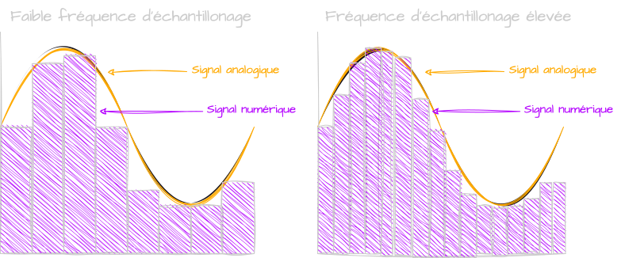
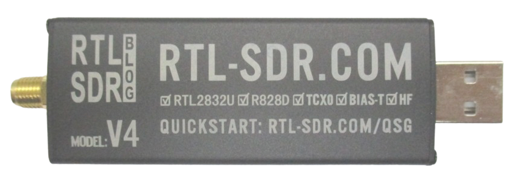

A la base, la réception des ondes radio utilise des composants comme des résistances, des condensateurs, des bobines... On retrouve un ensemble de pièces pour le traitement du signal comme les filtres, bref c'est un système qui existe depuis très longtemps 📻.
L'inconvénient, c'est que chaque composant est une entité physique, ça coûte cher, ça peut prendre de la place, et modifier les caractéristiques d'un d'entre eux demandent des compétences poussées en éléctronique.  
# ⚪️ Récepteur numérique 
L'idée va être de numériser le signal le plus tôt possible pour l'envoyer à un **CPU** où l'on pourra commencer notre traitement du signal. L'avantage est que l'on pourra utiliser des algorithmes beaucoup plus complexes, notamment à l'aide des **nombres complexes** qui sont très difficiles à mettre en place avec des résistances ou autres. 
Et oui, ces fameux nombres qu'on pensait inutiles au lycée ont une réelle utilité pour les signaux. 
- La partie **réelle** du nombre sert à représenter l'**amplitude** (sa hauteur en quelque sorte) du signal.
- La partie **imaginaire**, pour réprésenter sa **phase** (sa position dans le temps). 

Ainsi, on va pouvoir simplifier des opérations mathématiques. 

Pas convaincu ? Prenons par exemple la multiplication de deux signaux (inutile de comprendre ce que ça signifie). 
Sans nombres complexes, il faudrait utiliser des calculs **trigonométriques** assez tordu. 
Alors qu'avec les nombres complexes, il suffirait de multiplier les amplitudes et ajouter leur phase, ce qui se fait simplement avec des opérations algébriques sur les nombres complexes (si si :D). 

De plus, le numérique se met simplement à jour, ce qui est pratique, notamment pour les logiciels ou autres algorithmes. 
Un autre gros avantage du numérique est de pouvoir utiliser un **analyseur de spectre** ce qui est très pratique pour faire du **debug**. C'est comme utiliser **WireShark** 🦈. 
# ⚪️ Fréquence d'échantillonage
Les signaux radios sont analogiques et comportent une infinité de valeurs, et ça nos **CPU** n'aiment pas les valeurs infinies, donc on vient capturer plusieurs points sur le signal à intervalle régulier afin de le transformer en un nombre fini. En fait, c'est plus précis de dire qu'on vient mesurer l'amplitude du signal à intervalle régulier puis qu'on vient stocker tout ça sous forme de nombres. C'est ça qu'on appelle la fréquence d'échantillonage ! 
Elle est rendue possible grâce à un **convertisseur analogique-numérique** (ADC). 
Plus on prendra d'échantillons, plus on aura un signal numérique fidèle à la réalité mais plus il sera lourd et long à traiter.

Il existe d'ailleurs un théorème, celui de **Nyquist–Shannon** qui dit que pour reconstruire à l'identique un signal analogique,  il doit être échantillonné à une fréquence au moins deux fois supérieure à sa fréquence maximale. En prenant une valeur 2 fois supérieure, on s'assure de reconstruire un signal analogique très précis. 
# ⚪️ Récepteurs SDR 
Numériser le signal et le traiter par logiciel a un nom, c'est la **SDR** (**S**oftware **D**efined **R**adio). Elle est rendue possible par des récépteurs comme par exemple celui-ci : 

Ces récepteurs bon marché ([lien vers un super kit pour débuter](https://fr.aliexpress.com/item/1005005952566458.html?spm=a2g0o.productlist.main.5.73d9dbXPdbXPEG&algo_pvid=525e2d1d-0980-4b25-9e4f-38905fefd577&algo_exp_id=525e2d1d-0980-4b25-9e4f-38905fefd577-2&pdp_npi=4%40dis%21EUR%2148.30%2148.30%21%21%2151.30%2151.30%21%4021059dbe17169245427093658e3802%2112000035000699472%21sea%21FR%214844539949%21&curPageLogUid=JaGxsn71xaP6&utparam-url=scene%3Asearch%7Cquery_from%3A)), se branchent en **USB** à un ordinateur équipé d'un logiciel **SDR** (il en existe plusieurs). On retrouve un port **MCX** (**M**icro **C**oaxial e**X**tended), c'est un connecteur **coaxial** plus petit que l'on relie à notre antenne. Ce dernier ne permet que la réception des signaux mais pas la transmission. Pour bénéficier des deux, il faudrait par exemple utiliser un [HackRF](../HackRF/presentation-hackrf-portapack.md). 
