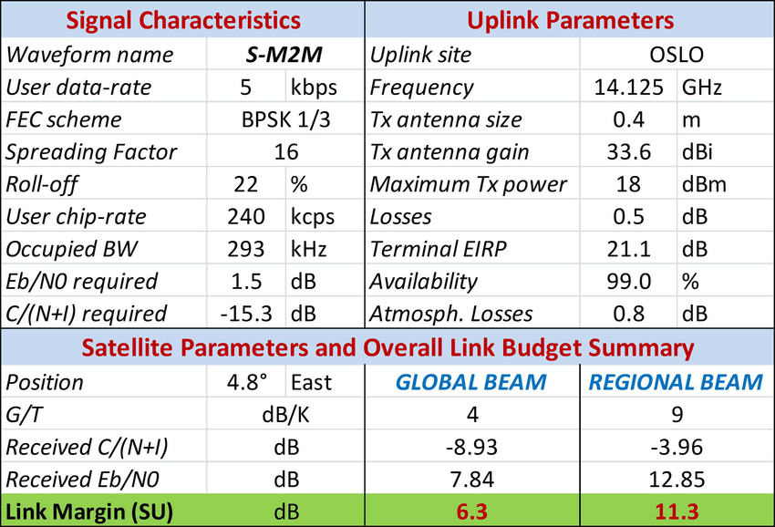

Une antenne satellite possède plusieurs facteurs importantes. Ces derniers sont primordiales à connaître pour faire le **budget link** (bilan de liaison) d'une antenne. 
On va dans ce cours, passer en revue quelques un de ces paramètres puis nous verrons comment claculer le **budget link**. 
Pour la suite, je pars du principe que les notions vu dans [ce cours](../../Radio/Radio%20Basics/power.html) sont acquises :) 

# ⚪️ EIRP (Equivalent Isotropic Radiated Power)
En français, la **PIRE** pour **P**uissance **I**sotrope **R**ayonnée **É**quivalente représente la mesure de la puissance rayonnée d'une antenne dans une direction spécifique par rapport à l'**antenne isotrope**. 
Pour comprendre, il faut voir l'**antenne isotrope** comme une bougie qui éclairerait dans toutes les directions de manière égale mais avec une lumière faible. À l'inverse d'une lampe torche qui éclaire plus fort mais dans une direction spécifique. Et bien la **PIRE** nous indique combien de bougies il faudrait pour obtenir la même intensité de lumière dans la direction où la lampe torche éclaire. 
Ça se calcule en utilisant cette équation : `EIRP = P - L + G`, où 
- **EIRP** est la **PIRE**, en `dB`.
- **P** la puissance de sortie de l'émetteur en `dBm` ou `dBW`.
- **L** les pertes de câble en `dB`.
- **G** le gain de l'antenne en `dBi`.

# ⚪️ Pertes de Transmission
Les pertes de transmission représentent les pertes de puissance du signal entre le **satellite** et une **station de sol**. 
Sans trop rentrer dans le détail, ces pertes sont classées en **2** catégories principales. 
##  Les pertes de propagation
Ce sont celles que rencontre le signal en traversant l'espace. 
On y retrouve les pertes à cause du vide spatial parce que oui, le vide spatial engendre une atténuation du signal.
On a aussi les pertes dues à l'atmosphère : 
Dans la **ionosphère** (couche haute), le signal est sujet à la **rotation de Fraday** causée par le champ magnétique de **La Terre**.
Dans la **troposhère** (couche basse), on a des facteurs comme par exemple la **pluie** qui peuvent atténuer le signal.

## Les pertes locales 
Il s'agit des pertes que l'on retrouve proche des stations de sol. 
Par exemple, celles dues à l'environnement comme la **température** ou l'**humidité**.
Ou encore celles dues aux composants des équipements satellites eux mêmes.

# ⚪️ System Noise
Le bruit système est un élement qui dégrade la qualité du signal reçu. 
Donc, dans la conception d'un satellite ou même d'autres trucs, on cherchera toujours à le minimiser le plus possible.
2 termes sont à connaître : 
- La **Densité spectrale de bruit** qui indique "combien de bruit" se trouve dans chaque petite portion de fréquence d'un signal. On l'exprime en `dB/Hz` ou `W/Hz`.
- la **Température du bruit** généré par un composant spécifique. Plus la température est élevée, plus il y a de bruit.

Différents facteurs peuvent amener du bruit. 
## Composants des récepteurs
Il s'agit des composants électriques que l'on retrouve dans les systèmes de communication et qui peuvent causer du bruit en raison de leur température de fonctionnement. Du coup, ces composants génèrent intrèsequement une certaine forme de chaleur qui atténue le signal. 

## Fond diffus cosmologique
Plutôt classe celui-ci, il s'agit d'un rayonnement de fond qui provient du **big bang** et qui possède toujours un impact sur les composants des satellites.

## Bruit Atmosphérique
Induit par **La Terre**, les décharges électriques dans l'atmosphère ou encore les variations de températures dans la journée peuvent génerer du bruit.

# ⚪️ Carrier-to-Noise Ratio & Signal-to-Noise Ratio
Pour quantifier la qualité d'une antenne, on va utiliser 2 ratios.
Le rapport porteuse sur bruit noté **C/N** ou **CNR** représente le rapport entre la puissance de la **porteuse** d'un **signal modulé** et la puissance du **system noise**.

Le rapport signal sur bruit noté **S/N** ou **SNR** représente le rapport entre la puissance du signal "en entier" et la puissance du **system noise**. 

# ⚪️ Gain-To-Noise Temperature
Noté **G/T**, il s'agit d'une mesure pour évaluer l'efficacité de la réception du signal par une antenne. C'est en fait un rapport entre le gain de l'antenne et la température du **system noise**. Là, où le **CNR** et **SNR** sont des rapports entre un **signal** et le **bruit**.
Le **G** s'exprime en `dB` et le **T** en `Kelvin (K)`.

# ⚪️ Budget Link
Après avoir vu quelques paramètres importants, passons au vif du sujet, le **bilan de liaison** (budget link).
Il s'agit d'un bilan de puissance qui prend en compte toutes les **pertes** et **gains** tout au long du trajet du signal, depuis l’**émetteur** jusqu’au **récepteur**.
On a des calculateurs en ligne qui permettent de le calculer comme [celui-ci](https://www.tutorialsweb.com/satcom/satellite-link-budget-calculator.htm).
Un exemple de **bilan de liaison** : 

Évidemment, dans ce cours, je n'ai présenté que quelques uns des paramètres qui composent un **budget link**. 
Mais pour aller plus loin, je vous invite à essayer le challenge [Linky](../HackASat/2021/linky.html) de **Hack-A-Sat** qui consiste à retrouver certaines valeurs d'un bilan de liaison. Vous en apprendrez encore plus :)

Merci à [Angelina Tsuboi](https://www.angelinatsuboi.net) qui m'a énormément inspiré pour ce cours. 