Durant [mon premier projet](../../Projects/NOAA.html) pour récupérer les images des satellites **NOAA**, j'avais évoqué le logiciel [Satdump](https://github.com/SatDump/SatDump) permettant de grandement nous simplifier la vie.
Aujourd'hui, je vais vous présenter sa version graphique avec une démo :) 

# Offline processing
Voilà comment se présente **SatDump** au lancement.
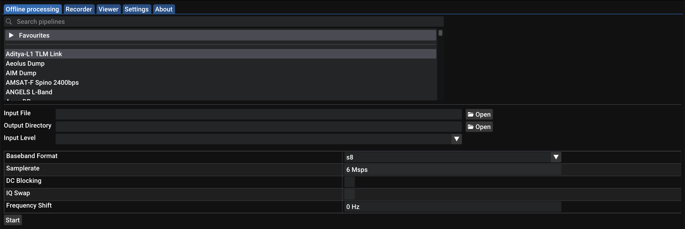
On tombe sur l'onglet **Offline Processing** qui est utile dans le cas où l'on a déjà un enregistrement qui provient d'un satellite. On a juste à choisir le satellite de provenance, notre fichier et cliquer sur **Start**, facile.
Mais on va pas trop s'y attarder, ça reste intuitif, passons plutôt à l'onglet **Settings** pour régler quelques trucs. 

# Settings
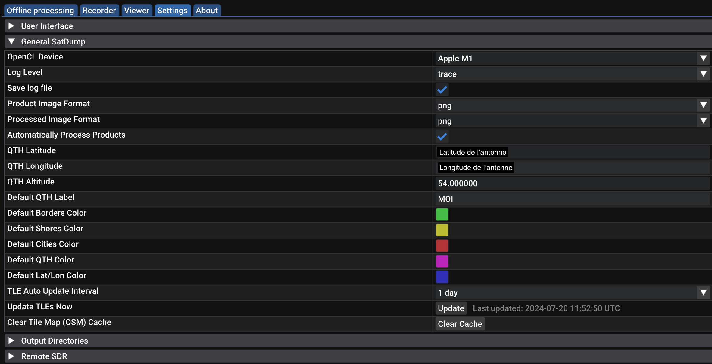
Ici, on va venir régler la position de notre récepteur (ça servira pour les prédictions de passage des satellites).
Donc, on y met notre **latitude**, **longitude**, **altitude**, éventuellement les couleurs (si on les veut) qui seront affichées sur les images qu'on récupèrent.
On voit aussi en bas la dernière fois que les [TLE](orbits.html) ont été mis à jour.
Ceci étant fait, allons dans l'onglet principal **Recorder**. 

# Recorder
## Device
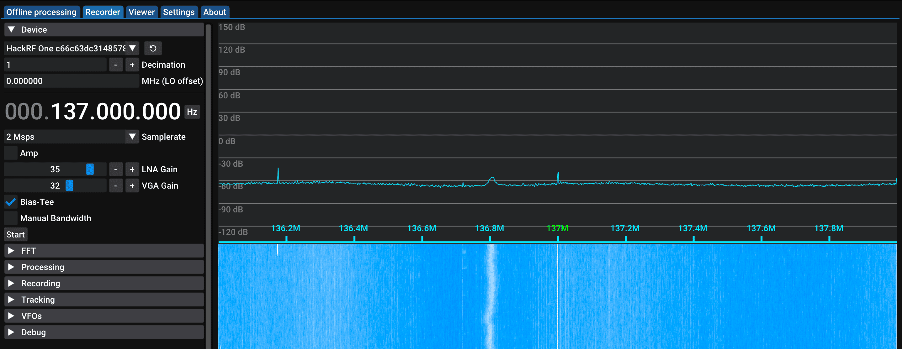
Ici, on choisit notre récepteur [SDR](../../Radio/SDR/sdr.html), dans mon cas, un [HackRF](../../Radio/HackRF/presentation-hackrf-portapack.html). On peut choisir notre **fréquence** d'écoute et notre **samplerate**.
Aussi, on peut modifier différents paramètres en fonction du récepteur **SDR**. On retrouve les différentes options possibles [ici](https://docs.satdump.org/sdr_options.html).
J'ai activé le **Bias-Tee**, ça permet d'alimenter un [filtre LNA](https://www.amazon.fr/gp/product/B07TWPR871/ref=ppx_yo_dt_b_search_asin_title?ie=UTF8&psc=1) directement avec son récepteur **SDR**. Mais si vous n'utilisez pas de filtre, n'activez pas cette option !
Sautons quelques sections pour voir celle permettant de voir et prédire le passage des satellites, l'onglet **Tracking**. 
## Tracking
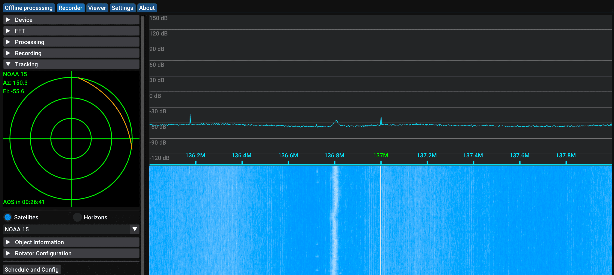
On peut y voir l'**azimuth** et l'**élevation** de n'importe quel satellite (donc là **NOAA 15**) par rapport aux positions géographiques qu'on a entré dans les **Settings**. 
Pour rappel, l'**azimuth**, c'est en quelque sorte la **direction** qu'indiquerait une boussole vers le satellite.
L'**élevation**, ça serait l'angle avec lequel il faut "lever les yeux" pour voir le satellite.

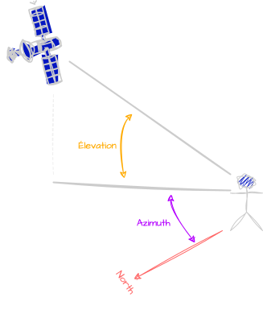
En dessous, le **polar plot**, très pratique, qui permet d'avoir une représentation graphique de nos deux valeurs. 
Le haut du graphique, ça représente l'**azimuth** à **0°**, le bas **180°**.
Le centre du graphique, c'est pour une **élevation** à **90°**, le premier anneau à partir du centre, **60°**, le second **30°** et le dernier, **0°** donc l'horizon.  
De plus, le **polar plot** permet de représenter le prochain passage d'un satellite avec la **ligne orange** qui représente la trajectoire du satellite et un **point rouge** pour sa position actuelle.  
On a aussi le **AOS** (**A**cquisition **O**f **S**ignal) qui indique dans combien de temps on pourrait enregistrer le signal pour commencer l'écoute.
À présent, cliquons en bas sur le bouton **Schedule and Config**
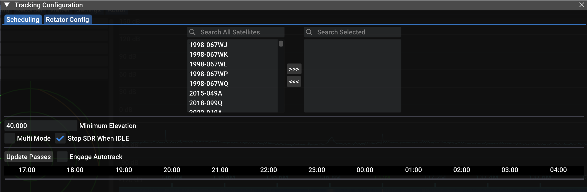
C'est ici qu'on va pouvoir prédire les prochains passage des satellites et éventuellement, lancer automatiquement l'acquisition du signal. 
Alors, en haut, on choisit les satellites qui nous intéressent.
On peut choisir l'élevation minimale pour laquelle on accepte que le prochain passage doit être prédit. Donc, dans mon cas, tout ce qui est en dessous de **40°** ne sera pas prédit. 
Une fois qu'on sélectionne les satellites qu'on veut écouter, on voit qu'on peut les "configurer". 
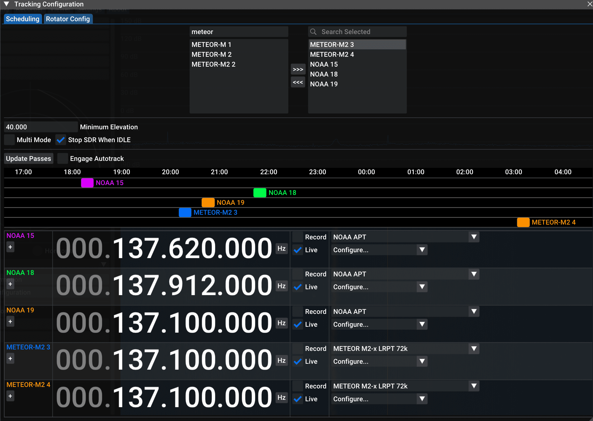
Les informations comme la **fréquence** ou le mode de transmission doivent être remplies manuellement. 
On peut alors cliquer sur le bouton **Update Passes** pour voir apparaître les prochains passage de nos satellites. Attention, l'heure indiquée est en **UTC**, je ne sais pas comment la modifier en heure française. 
Dans mon cas, le prochain passage est donc prévu à **20h21** jusqu'à **20h37** avec une élevation maximale de **61°** :
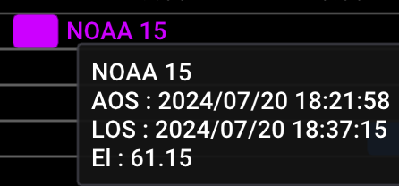
Toute cette partie sert dans le cas où vous souhaitez laisser votre ordinateur relier à l'antenne et que les enregistrements se fassent tout seul. Mais on peut aussi s'en servir pour rapidement jeter un coup d'oeil pour le prochain passage et faire les choses après plus ou moins manuellement.

## Recording
Vite fait, l'onglet **Recording**.
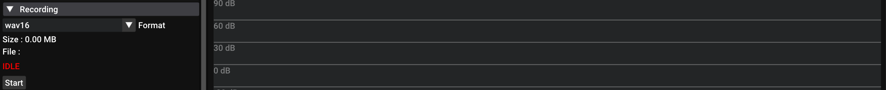
Comme son nom l'indique, il permet de sauvegarder un signal dans un fichier. On pourra ainsi le conserver pour le traiter par la suite, soit sur l'onglet **Offline Processing**, soit avec un autre logiciel de traitement de signal. Plusieurs formats de fichiers sont pris en charge. 

## Processing
Avec l'onglet **Processing**, on va pouvoir préciser de quelle manière on veut traiter le signal reçue et le décoder en **temps réel** !

En glissant son curseur sur les différents paramètres, on a plus d'informations sur ce qui font donc je vais pas m'y attarder. Ce qui est intéressant, c'est que lorsqu'on sélectionne le mode, donc sur mon exemple **NOAA APT**, on nous propose lequel des 3 **NOAA** on souhaite écouter, et lorsque l'on en choisit un, automatiquement, la fréquence d'écoute se met à jour sur la bonne.
Le bouton **Start** restera grisé tant qu'on aura pas lancé l'écoute depuis l'onglet **Device**.

Globalement, on a vu les onglets principaux pour commencer à utiliser **SatDump**, il en reste un, le super onglet **Viewer** que l'on verra après la démo car il nous faut un enregistrement pour avoir des choses à montrer. 

# Exemples d'utilisation 
Allez, c'est parti, on va écouter **NOAA 15**. J'appuie sur **Start** depuis l'onglet **Device** puis sur **Start** dans l'onget **Processing** en ayant configuré le traitement pour le mode **APT**. 
Voici une capture d'écran lorsque le satellite passe : 
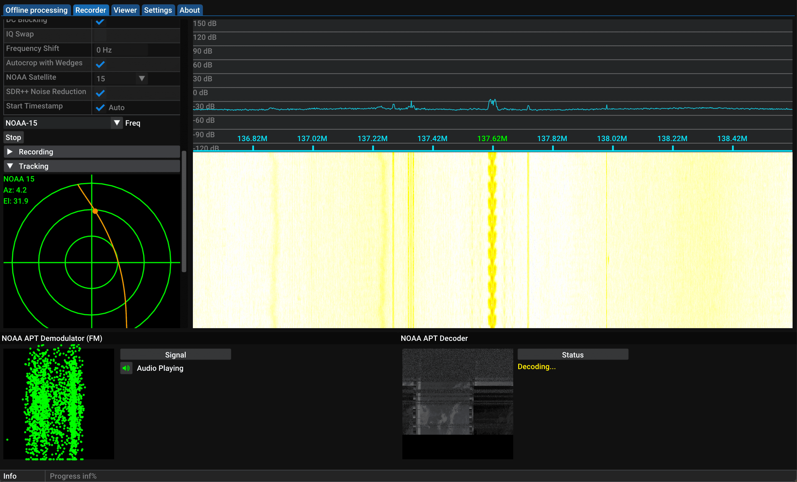
On peut voir en bas en temps réel le scan progressif du satellite apparaître. Aussi, on constate la position du satellite avec le point rouge sur le **polar plot**.
Une fois l'acquisition terminée, on appuie sur le **Stop** de l'onglet **Processing** (Pas celui de l'onglet **Device** si non, **SatDump** ne va pas comprendre que le traitement est terminé). 
Et l'on peut à présent décaller sur l'onglet **Viewer** pour voir nos résultats.

# Viewer
Voilà mon image, bon elle est pas dingue mais c'est pour la demo.
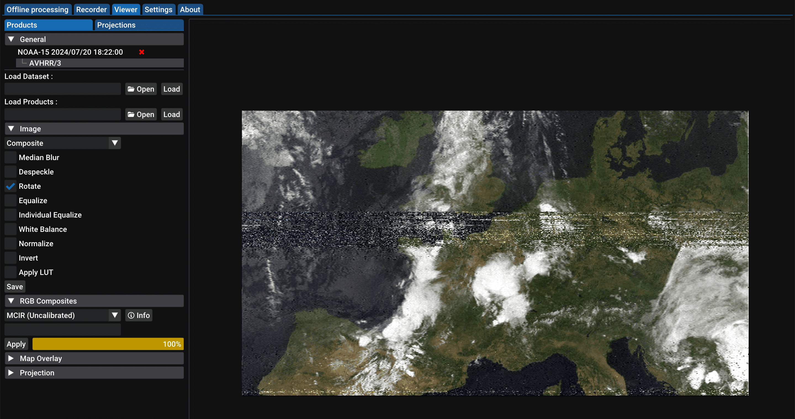
Cet onglet est vraiment génial, on va pouvoir traiter en temps réel notre image, là par exemple, j'ai appliqué le mode d'image **MCIR** qui permet d'avoir de fausses couleurs sur notre image.
On peut jouer avec les différents paramètres en fonction de ce que l'on souhaite mettre en valeur. 
Par exemple, afficher des couleurs pour les probabilités de pluie, les frontières des pays et bien d'autres trucs sympas.
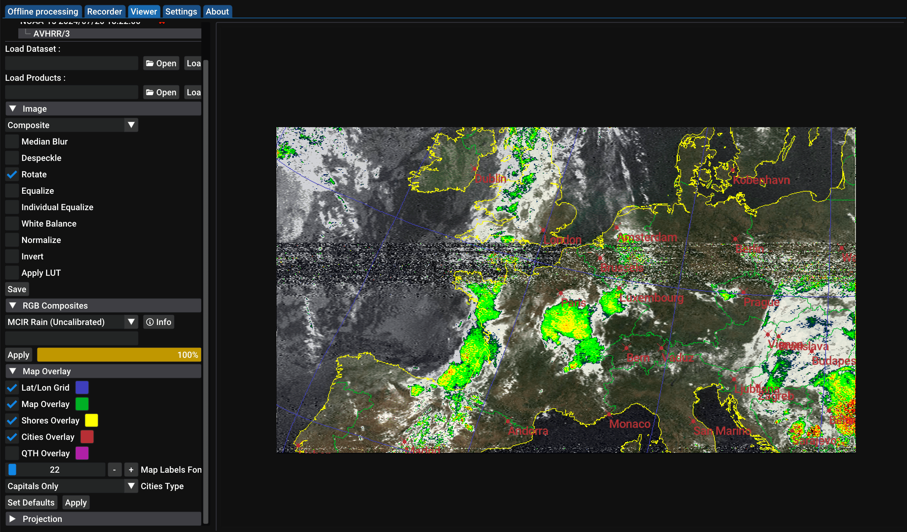
Et voilà pour ce super **SatDump** qui permet en un seul logiciel de faire plusieurs choses à la fin, de la prédiction, de l'acquisition de signal et même le traitement de ce denier. Peut-être un jour, j'aurais la possibilité de tester un **rotor** d'antenne car **SatDump** les prend en charge, ça peut être cool. 
Évidemment, je n'ai pas tout présenté, je vous laisser explorer le reste par vous même :)
