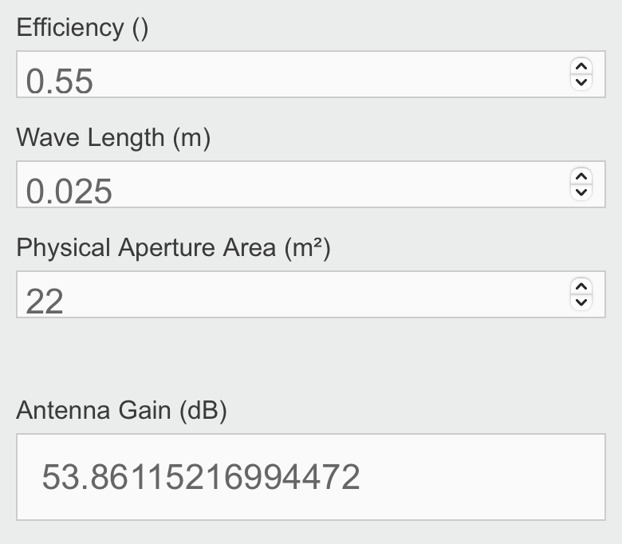
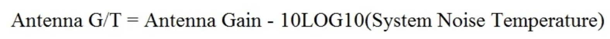
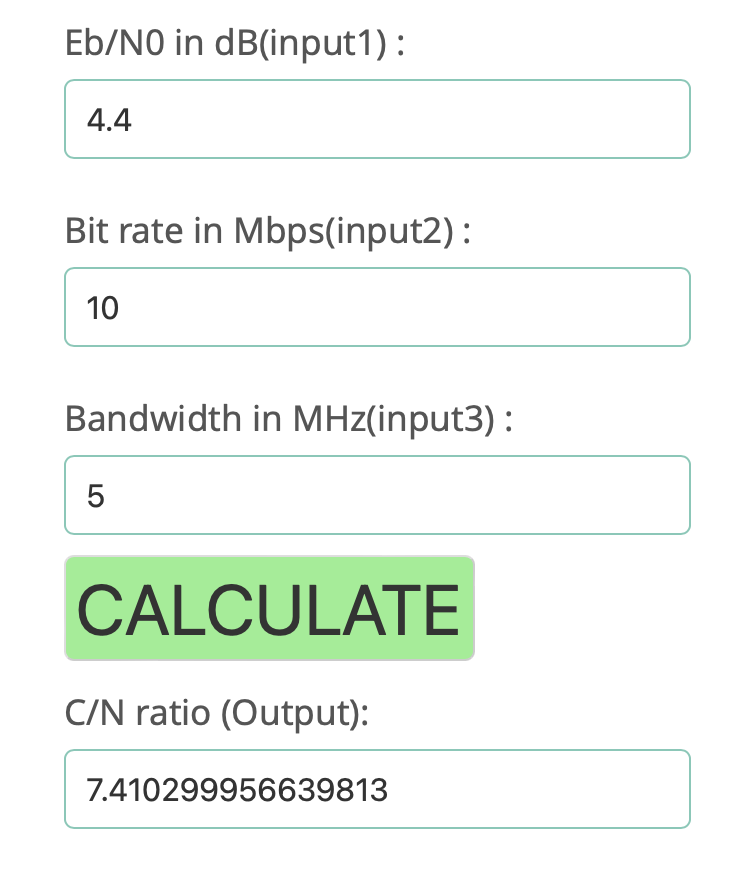

Description du challenge : *Years have passed since our satellite was designed, and the Systems Engineers didn't do a great job with the documentation. Partial information was left behind in the user documentation and we don't know what power level we should configure the Telemetry transmitter to ensure we have 10 dB of Eb/No margin over the minimum required for BER (4.4 dB)*

Le challenge est disponible à [cette adresse](https://github.com/cromulencellc/hackasat-qualifier-2021/tree/main/linky)

Le but de ce challenge est de trouver certains points du [bilan de liaison](https://fr.wikipedia.org/wiki/Bilan_de_liaison) (**budget link**). Pour compléter une documentation utilisateur pour les ingénieurs des satellites. Le **bilan de liaison**, c'est juste un bilan de puissance qui prend en compte toutes les **pertes** et **gains** tout au long du trajet du signal, depuis l’**émetteur** jusqu’au **récepteur**.
Alors oui, ça fait pas trop **challenge de CTF** mais faire des calculs sur des notions qu'on a l'habitude d'entendre comme le **gain** permet de mieux comprendre et approfondir certains aspects donc c'est pas plus mal :)  

Donc, lorsque l'on accède à l'instance on nous donne ça : 
```bash
> docker run --rm -i linky:challenge
...
Here's the information we have captured

************** Global Parameters *****************
Frequency (Hz): 12100000000.0
Wavelength (m): 0.025
Data Rate (bps): 10000000.0
************* Transmit Parameters ****************
Transmit Line Losses (dB): -1
Transmit Half-power Beamwidth (deg): 26.30
Transmit Antenna Gain (dBi): 16.23
Transmit Pointing Error (deg): 10.00
Transmit Pointing Loss (dB): -1.74
*************** Path Parameters ******************
Path Length (km): 2831
Polarization Loss (dB): -0.5
Atmospheric Loss (dB): -2.1
Ionospheric Loss (dB): -0.1
************** Receive Parameters ****************
Receive Antenna Diameter (m): 5.3
Receive Antenna Efficiency: 0.55
Receive Pointing Error (deg): 0.2
Receive System Noise Temperature (K): 522
Receive Line Loss (antenna to LNA) (dB): -2
Receive Demodulator Implementation Loss (dB): -2
Required Eb/No for BER (dB): 4.4

Calculate and provide the receive antenna gain in dBi:
```
Ok, ça fait pas mal d'informations. 

# ⚪️ Calcul du gain 
On va utiliser ce [site](https://calculator.academy/antenna-gain-calculator/). Ce dernier nous demande 3 paramètres : 
- L'**efficacité** de réception de l'antenne. Elle nous est donné, elle vaut `0.55`.
- La **longueur d'onde.** On l'a aussi, elle vaut `0.025m`. 
- La surface d'**aperture** physique de l'antenne. Alors, ça on l'a pas mais on peut le calculer facilement. C'est juste la surface géométrique réelle qui capte ou émet les ondes. On nous donne le diamètre de notre antenne donc au final, sa surface physique, c'est juste son aire qui se calcule avec la formule `π*r^2` avec `r` le rayon. Dans notre cas, il vaut `r=5.3/2=2.65m`
  
Donc, calculons cette surface :  `π*r^2=π*2.65^2=22`. On peut à présent rentrer toutes nos valeurs dans le calculateur de gain : 

Super, on a notre gain qui vaut à peu près **54dB**. On peut répondre à la question et ça nous renvoit ceci : 
```bash
Good job.  You get to continue
Receive Antenna Gain (dBi): 54.00
Receive Half-power Beamwidth (deg): 0.33
Receive Pointing Error (deg): 0.2
Receive Pointing Loss (dB): -4.48

Okay, now we know the receive antenna gain.
Calculate and provide the ground terminal G/T (dB/K):
```

# ⚪️ Calcul du G/T (Gain-To-Noise Temperature)
Il s'agit d'une mesure pour évaluer l'efficacité de la réception du signal par une antenne.
Le **gain** on connaît bien grâce à ce [cours](/Mini-cours/Radio Basics/gain_decibel.html). Pour ce qui est du **Noise Temperature**, c'est une mesure de l'énergie de bruit présente. On a un [calculateur](https://www.rfwireless-world.com/calculators/Antenna-G-T-ratio.html) pour ça qui utilise la formule suivante : 

Pour l'**antenna gain**, on l'a calculé avant, il vaut `54` mais **attention**, on veut le **G/T** de la **station de sol** (ground terminal), pas juste de l'**antenne** donc il faut aussi prendre en compte les pertes de transmission qui nous sont donnés `Receive Line Loss (antenna to LNA) (dB): -2`. On parle de **gain effectif** dans le cas où on prend en compte les pertes. Le calcul reste le même pour autant. Donc, notre **gain effectif** vaut `54-2=52`.
Le **system noise temperature** nous est donné à `522K`. 
Calculons tout ça : 

Ok, très bien, on trouve `24.8dB/K`
```bash
Calculate and provide the ground terminal G/T (dB/K): 24.8

Nicely done.  Let's keep going.
Determine the transmit power (in W) to achieve 10dB of Eb/No margin (above minimum for BER):
```
SUPER ! On peut passer à la suite. 

# ⚪️ Calcul du Transit Power
À présent, on doit calculer la puissance de transmission pour atteindre une marge de **10dB** de **Eb/No** au-dessus du minimum requis pour le taux d’erreur binaire (**BER**). Bon. C'est quoi tout ça 😅.
Le **BER** (**B**it **E**rror **R**ate) c'est la proportion de bits reçus avec des erreurs par rapport au nombre total de bits transmis.
Pour toute la suite, [ce document](http://www.eletrica.ufpr.br/evelio/TE111/Eb_N0.pdf) va nous être bien utile si ce n'est indispensable :)
Ça nous dit que pour calculer le **transmit power**, il y a 3 étapes : 
- 1 : Déterminer le **Eb/No** pour le **BER** voulu.
- 2 : Convertir le **Eb/No** en **C/N** (**C**arrier-to-**N**oise ratio). 
- 3 : Ajouter les pertes de chemin et les marges d’affaiblissement.


## 1 : Déterminer le Eb/No
Le **Eb/No** pour le **BER**, on nous le donne, c'est `4.4dB`.

## 2 : Convertir le **Eb/No** en **C/N**
Le **C/N** (**C**arrier to **N**oise), c'est un ratio qui représente la qualité du signal **porteur** par rapport au bruit donc plus c'est élevé, plus le signal est fort et donc mieux c'est. A ne pas confondre avec le **SNR** (**Signal** to **N**oise **R**atio) qui mesure la même chose mais au lieux que ça soit le **signal porteur**, c'est tous le signal "en entier".
On va utiliser [ce calculateur](https://www.rfwireless-world.com/calculators/Eb-N0-and-BER-calculator.html) qui se sert de cette formule.

On a besoin du **bit rate**, tant mieux, on nous le donne aussi, c'est `10000000.0bps` donc `10Mbps`.
On aussi besoin de la bande passante du récepteur. D'après l'exemple sur le **pdf**, ça vaut la moitié du **bit rate** donc `10/2=5MHz`.
On remplit tout ça et on obtient `C/N ≈ 7.4dB`


## 3 : Ajouter les pertes et les marges
### Carrier Power
Le **carrier power** (**puissance de la porteuse**) se calcule avec la formule suivante :
`C = C/N * N` ou en **dB** `C = C/N + N` avec `C/N` en `db`, `N` le **noise power** en `W`.

#### Noise Power
Donc, on doit d'abord calculer le **Noise Power** (Puissance du bruit) avec cette formule :
`N = k * T * B` avec `k` la [constante de Boltzmann](https://fr.wikipedia.org/wiki/Constante_de_Boltzmann) qui vaut `1.380650x10-23 J/K`, `T` la température effective en `Kelvin` et `B` la bande passante du récepteur en **Hz**. 
Quand on parle de **puissance de bruit**, on parle en réalité du **bruit thermique** généré par l’agitation thermique des électrons dans un conducteur, c'est pour ça qu'on utilise le `Kelvin`. Plus la température est élevée, plus les électrons s'agitent et plus le **bruit** est fort. Bref, calculons tout ça : 
```bash
>>> boltzman = 1.38065e-23 # J/K
>>> data_rate = 10000000.0 # nous est donné
>>> bandwidth = data_rate / 2 # Hz
>>> effective_temperature = 290 # on prend la même que le PDF
>>> noise_power = boltzman * effective_temperature * bandwidth
>>> print(noise_power)
2.0019425e-14 # watts
```
Super, on a noter `N = 2.0019425e-14W`
Sauf qu'il ne faut pas oublier d'ajouter le bruit naturel auquel fait fasse notre récepteur. Ainsi, il faut aussi lui ajouter le **noise figure** qui mesure la dégradation du **SNR** en prenant comme référence une température de `290K` (C'est une température de **réference** à laquelle les mesures de bruit sont normalisées). Le **noise figure** est un **ratio** alors que le **noise power** est une **mesure absolue**.
### Noise Figure
On peut utiliser [ce site](https://www.allaboutcircuits.com/tools/noise-figure-noise-temperature-calculator/) pour récupérer ce dernier. 

Le **noise temp**, il nous est donné à `522K` et pour la **reference temp**, j'utilise la même que le **guide** donc `290K`. 

Et pour le **noise power**, on l'avait déjà calculé (`2.0019425e-14`) mais le résultat était en **watt**. Mettons le donc en `dBm` : 
```bash
>>> import math
>>> noise_power_w = 2.0019425e-14 # W
>>> noise_power_mw = noise_power_w * 1000 # mW
>>> noise_power_dBm = 10*math.log10(noise_power_w) # dbm
>>> print(noise_power_dBm)
-106.98548400528693
```
On ajoute notre **noise figure** et **noise temp** : `4.4716 - 106.98548400528693 ≈ -102.5dBm`

Et enfin, on a notre **carrier power** : `C = 7.4 - 102.5 = -95.1dB`.
Il s'agit de la puissance que reçoit le récepteur en entrée.

### Path Loss
La **path loss** (pertes de propagation) en `dB` pour un site en plein air suivent cette formule : `PL = 22dB + 20log(d/λ)` avec `d` la distance entre l'émetteur et le récepteur. Et `λ` la longueur d'onde de la porteuse. Ces 2 valeurs nous sont déjà données.
```bash
>>> distance = 2831000 # m
>>> wavelength = 0.025 # m
>>> path_loss_dB = 22 + 20*math.log10(distance/wavelength) # dB
>>> print(path_loss_dB)
183.0799972138613
```
Okkk, on a notre `PL=183.0799972138613`

### Transmit Power
On arrive au bout là, plus qu'à additionner tout ça ainsi que les autres pertes qui nous sont données et on aura enfin ce que l'on recherhe, le **transmit power** : 
```bash
>>> transmit_line_losses = 1
>>> transmit_pointing_loss = 1.74
>>> polarization_loss = 0.5
>>> atmospheric_loss = 2.1
>>> ionospheric_loss = 0.1
>>> receive_pointing_loss = 4.48
>>> carrier_power_dBm = -95.1
>>> path_loss_dB = 183.0799972138613
>>> margin_dB = 10
>>> tx_antenna_gain_dBi = 16.23
>>> rx_antenna_gain_dBi = 54.00
>>> tx_power_dBm = transmit_line_losses + transmit_pointing_loss + polarization_loss + atmospheric_loss + ionospheric_loss + receive_pointing_loss + carrier_power_dBm + path_loss_dB + margin_dB - tx_antenna_gain_dBi - rx_antenna_gain_dBi # dBm
>>> tx_power_w = 10 ** (tx_power_dbm / 10) * 10**-3 # watt
>>> print(tx_power_W)  
5.847897089829658
```
SUPER, donc notre **puissance de transmission** serait `5.8W`.
```bash
Determine the transmit power (in W) to achieve 10dB of Eb/No margin (above minimum for BER): 5.8
Sorry, you lost
Wrong! Maybe next time.
```
AIE 🥲. Pourtant, le résultat est vraiment super cohérant. 
Du coup, on va brute force, tant pis. Voici le script : 
```python
from pwn import *

context.log_level = "critical"

output = b"Wrong answer! You lose."
tx_power = 5.0

while b"Wrong" in output:
    command = "docker run --rm -i linky:challenge"
    p = process(command, shell=True)

    p.recvuntil(b"Calculate and provide the receive antenna gain in dBi: ") 
    p.send(b"54\n") 
    
    p.recvuntil(b"Calculate and provide the ground terminal G/T (dB/K): ") 
    p.send(b"24.8\n")

    p.recvuntil(b"Determine the transmit power (in W) to achieve 10dB of Eb/No margin (above minimum for BER): ") 
    print(f"Trying with Power Transmission = {tx_power:.1f}")

    tx_power_formatted = f"{tx_power:.1f}\n"
    p.send(tx_power_formatted.encode())

    output = p.recv() 
    p.close()
    
    tx_power += 0.1

print(output.decode())
```
On lance notre super script est ... :
```bash
> p pouet.py
Trying with Power Transmission = 5.0
Trying with Power Transmission = 5.1
...
Trying with Power Transmission = 9.4
Trying with Power Transmission = 9.5

Winner Winner Chicken Dinner
```
OK, ça a l'air d'être `9.5W`, un peu loin de ce que l'on a trouvé mais tant pis, on essaie cette valeur et let's gooo, on a le flag ! 
Et voilà pour ce challenge avec pleins de calculs. En faisant ce chall sérieusement, on en apprend vraiment pas mal sur toutes ces notions en **radio** donc je valide :) 