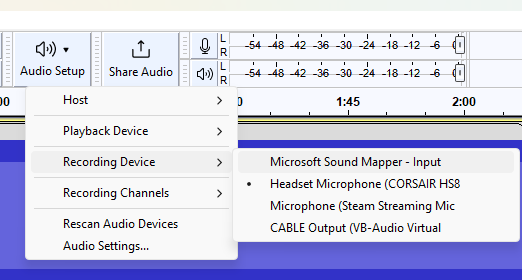
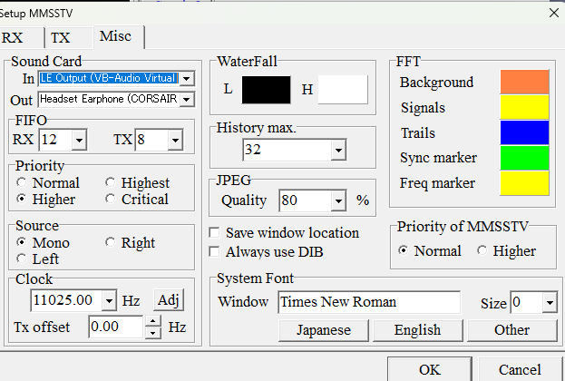
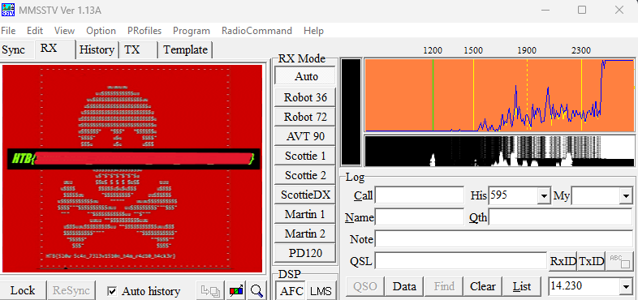

Description du challenge : 
*Some amateur radio hackers captured a strange signal from space. A first analysis indicates similarities with signals transmitted by the ISS. Can you decode the signal and get the information?*

On démarre avec un fichier `.wav` qui pour mes oreilles ne veut rien dire. En revanche, il est dit que ça ressemble à un signal de l'**ISS** et en cherchant un peu, on tombe sur la [SSTV](https://www.leradioscope.fr/trafic/2016-03-30-14-42-59/sstv) qui est l'abréviation de **Slow Scan Television**. 

Bonne vidéo à ce sujet : [ICI](https://www.youtube.com/watch?v=E52xr5AKnjQ&t=6s).

De ce que j'ai compris, le **SSTV** c'est un mécanisme qui permet de communiquer des images avec des signaux radio. 

En cherchat un un moyen de decoder ce type d'images, j'ai trouvé ce [tool](https://hamsoft.ca/pages/mmsstv.php). 
L'idée va être de lui faire écouter le son pour qu'il puisse décoder une image. Y a pas moyen d'importer notre son en `.wav` direct donc on va devoir utiliser un câble audio virtuel pour faire croire au logiciel que le son provient d'un vrai câble audio. Le premier logiciel qui nous tombe sous le code est [celui-ci](https://vb-audio.com/Cable/). Il va créer comme un tunnel entre notre émeteur (`Audacity` dans notre cas) et le récepteur (`MMSSTV`). 

Donc, on lance `VB-Audio` en tant qu'administrateur pour qui l'installe les drivers puis on doit reboot notre PC. Sur `Audacity`, on change notre **Recording Device** pour choisir notre câble audio virtuel.

On change aussi le **input** depuis `MSSTV` en allant dans **Options** puis **setup MMSTV**

A present, `MMSTV` écoute un signal provenant d'`Audacity` directement. On lance notre signal et progressivement apparaît notre image jusqu'à ce rendu final : 

Nous avons notre flag ! 