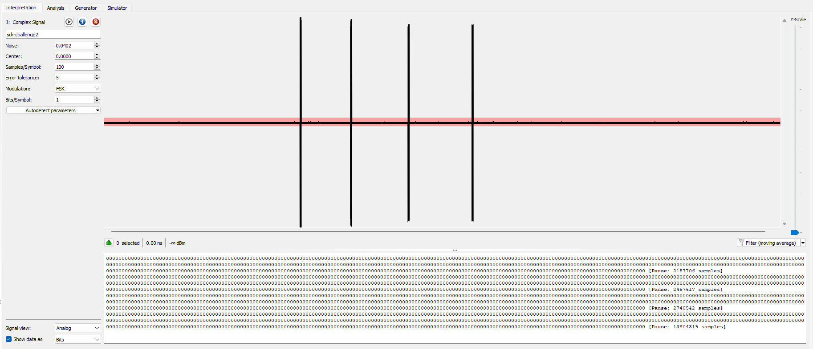
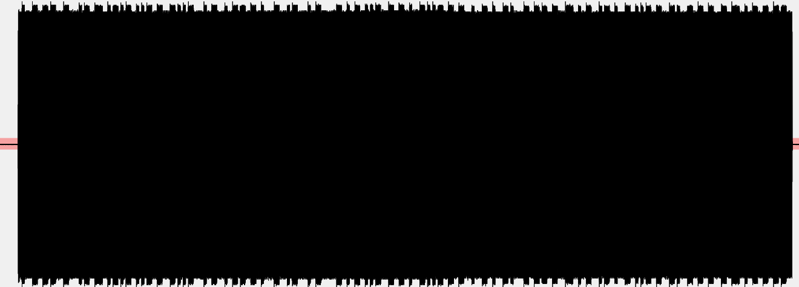
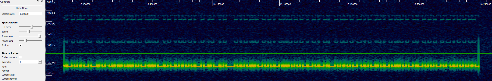
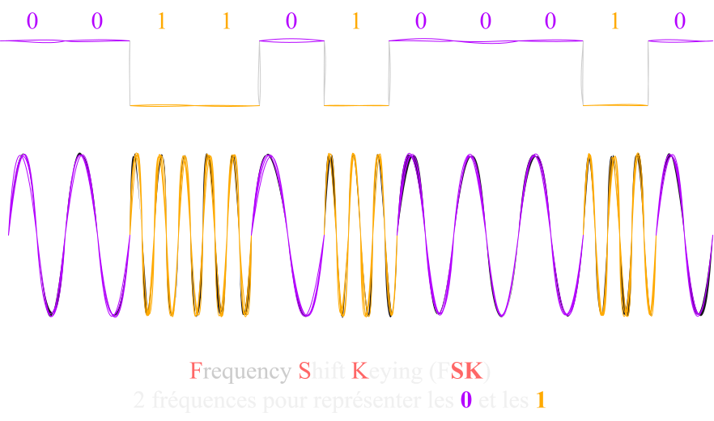
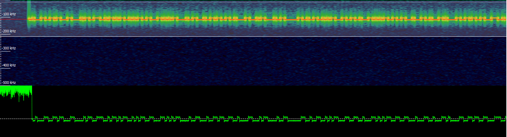
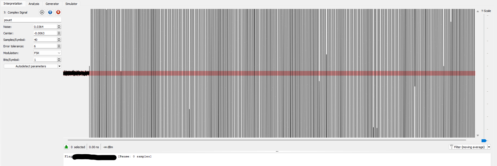

Description du challenge : *The aliens are on to us... They've started wearing tin foil hats and switched things up with their radio transmission. Can you crack their latest message?*
Le challenge est disponible à [cette adresse](https://ringzer0ctf.com/challenges/333).
Pour comprendre le writeup, il est important de comprendre la notion de modulation, alors n'hésite pas à jeter un oeil sur [ce cours](../Radio/Radio%20Basics/modulation.html) :) 

Le challenge commence avec un fichier `sdr-challenge2.cfile`. 
Ouvrons-le avec [Universal Radio Hacker](https://github.com/jopohl/urh). 

On retrouve plusieurs morceaux simillaires, en zoomant sur l'un d'entre eux, on remarque tout plein de bruit, rien qui puisse nous aider en l'état. 

Je décide de l'ouvrir avec [Inspectrum](https://github.com/miek/inspectrum) afin d'afficher le **spectrogramme**. Par défaut, il ouvre le signal hyper zoomé donc on voit rien, faut scroll avec le curseur du bas pour atteindre un des morceaux et obtenir ça : 

Sachant que pour le **Sample Rate**, j'ai mis au pif, c'est pas très grave, ça permet de faire apparaître au moins les fréquences.
Donc nous voilà avec un spectrogramme qui montre l'intensité du signal en fonction du **temps** (axe horizontal) et de la **fréquence** (axe vertical). 
Déjà, on voit plus de choses intéressantes. Notamment le fort signal en bas (**trait rouge qu'on voit pas très bien**) qui alterne de manière brusque entre **2 fréquences**. On peut alors supposer qu'il s'agit d'une modulation **FSK** (**F**requency **S**hift **K**eying).
Ce type de modulation numérique utilise une fréquence pour représenter un **0** et une autre pour représenter un **1**.

Faisons un clic droit dessus, puis `Add Derived plot` et `Add Frequency Plot`. Et on peut par la suite, sélectionner uniquement le bout du signal qui nous intéresse. 

Cela nous permet de faire une analyser plus précise en observant clairement la puissance du signal varier au fil du temps à une fréquence spécifique. 
Et au vue de la forme, on est à présent sur qu'il s'agit d'une modulation **FSK**, on peut alors extraire uniquement cette partie du signal en faisant un clic droit sur le morceau du haut (**pas celui du bas !**), puis `Export samples to file...`. On le laisse en `.f32`. 
À présent, ouvrons le à nouveau avec **Universal Radio Hacker** :
À partir de là, je vais aller plus vite car j'avais déjà expliqué comment trouver les bons paramètres dans [le précédent challenge](turn_me_on_and_off.html) donc n'hésites pas à y jeter un coup d'oeil si tu comprends pas tout ce qui suit.  
Donc, on sélectionnes comme modulation **FSK**, on peut cliquer sur **Autodetect parameters** ce qui permet de trouver le **Samples/Symbol** tout seul et en basculant la vue de **Bits** en **ASCII**, on obtient direct le flag :) 

