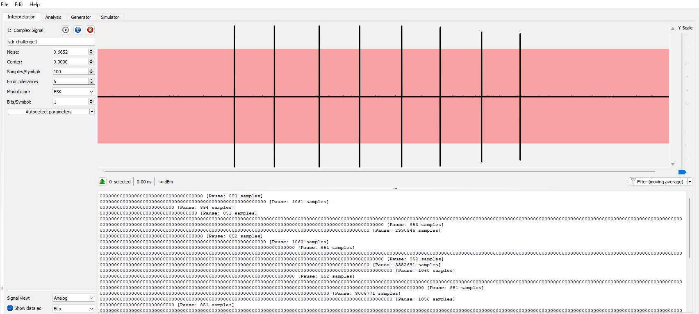
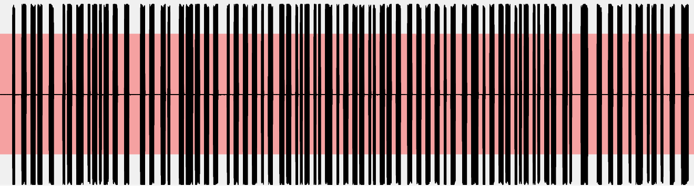
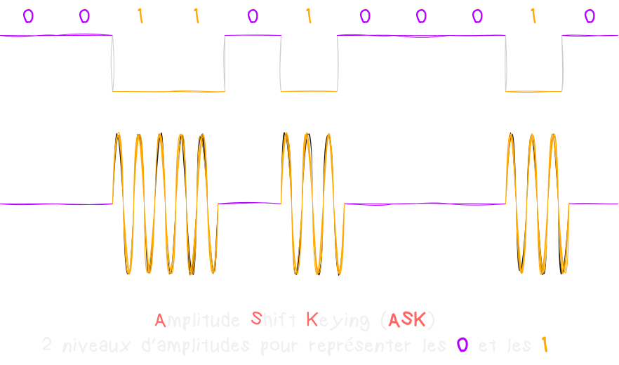

Description du challenge : *We captured alien radio data... Can you crack their message?*
Le challenge est disponible à [cette adresse](https://ringzer0ctf.com/challenges/332).
Pour comprendre le writeup, il est important de comprendre la notion de modulation, alors n'hésite pas à jeter un oeil sur [ce cours](../Radio/Radio%20Basics/modulation.html) :) 

Le challenge commence avec un fichier `sdr-challenge1.cfile`. 
Ouvrons-le avec [Universal Radio Hacker](https://github.com/jopohl/urh). 

Ok, on a plusieurs morceaux, en zoomant sur l'un d'entre eux, on peut supposer le type de modulation.

Il s'agit d'une modulation **ASK** (**A**mplitude **S**hift **K**eying) et plus précisément une modulation **OOK** (**O**n **O**ff **K**eying). 
En **ASK**, de manière générale, on utilise l'**amplitude** du signal porteur pour représenter les données, où différentes **amplitudes** représentent différents **bits**. 
Et donc, en **OOK**, pour représenter un **bit** à **1**, on va envoyer un signal (**on**) et pour représenter un **0**, on envoit rien (**off**).

Ce type de modulation est très utilisé pour envoyer des données numériques comme avec des clés de portail. 
Du coup, depuis **URH**, on peut sélectionner comme type de modulation **ASK**. On peut aussi changer le **Show sata as** en sélectionnant **ASCII** en bas à gauche afin de pouvoir lire les données en clair.
Mais autre truc important à trouver, c'est le **Samples/Symbol** qui fait réference au nombre de fois que le signal est mesuré (échantilloné) pour chaque symbole transmis. Par symbole, on entend "unité de transmission".
Genre, nous comme c'est une modulation binaire, si on met le **Samples/Symbol** à **10**, ça veut dire que pour **chaque bit transmit**, le signal sera échantilloné **10 fois**. 
Enfin bref, cette valeur est super importante à trouver puisque c'est grâce à elle qu'on pourra correctement décoder notre signal. Pour la trouver, soit on clique sur **Autodetect**, des fois ça marche (comme ici où il me trouve **200**) mais apprenons à le faire manuellement quand même :)  

Pour ce faire, on va devoir repérer le **plus petit** morceau de signal. 
Zoomons sur le premier morceau de l'image précedente qui semble faire partie des plus petits. Et on sélectionne "à peu près" ce morceau pour regarder en bas la valeur qui nous est affichée. Ici, **210**, donc avec mes mots, on peut dire que le **210** c'est la taille du plus petit mot qu'on puisse faire et donc la taille d'**1** symbole. Si on veut faire des mots plus grands, leur taille sera un multiple de **210**. 
Bref, changeons notre **Samples/Symbol** avec cette valeur.

A noter que c'est pas la valeur exacte, c'est une valeur approximative, j'ai pas le tricks pour trouver exactement la bonne valeur, et d'ailleurs, ce que je trouve est légèrement différent de ce que nous donnait l'**Autodetect**.
Pas grave, on voit qu'au niveau de ce qui est décodé, ça veut pas dire grand chose mais hors mis la dernière, chaque ligne est simillaire. Le même signal est répété.

Pendant longtemps, je n'ai pas compris pourquoi je n'arrivais pas à mettre la main sur le flag, surtout qu'en mettant le **Samples/Symbol** à **190**, j'obtiens des valeurs comme celle-ci : 

On voit qu'une bonne partie est consitutée de "vraies" caractères, et non, c'est pas de l'hexa que je peux décoder... 
Après pas mal de recherches, j'ai finis par trouver un paramètre qui change la donne. 
En cliquant sur la clé à molette à droite du type de modulation, on peut désactiver la valeur **Pause Threshold**. Et en faisant, ça toutes les données s'affichent plus que sur une ligne avec dedans le **flag** !
Ce paramètre sert à déterminer les pauses ou les intervalles de silence entre les données du signal. C'est en gros le nombre minimum d'échantillons de silence consécutifs qu'il faut pour dire *"Ah ! là y a une pause"* dans la transmission. 
Par défault, **URH** met cette valeur sur **8**, donc pour lui, il y a une pause tous les **8 échantillons** consécutifs où le signal est en dessous d'un certains niveau (considéré comme silence).
Bref, en désactivant cette contrainte, **URH** ne cherche plus de pauses et réussi à décoder le signal.

Et voilà pour ce premier challenge d'une "transmission alien", on va pouvoir passer à la suivante dans un prochain article... 